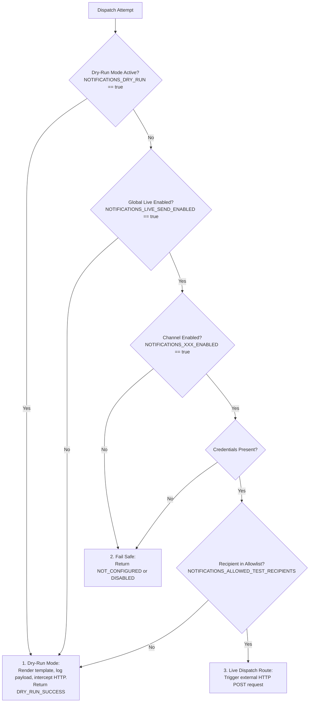
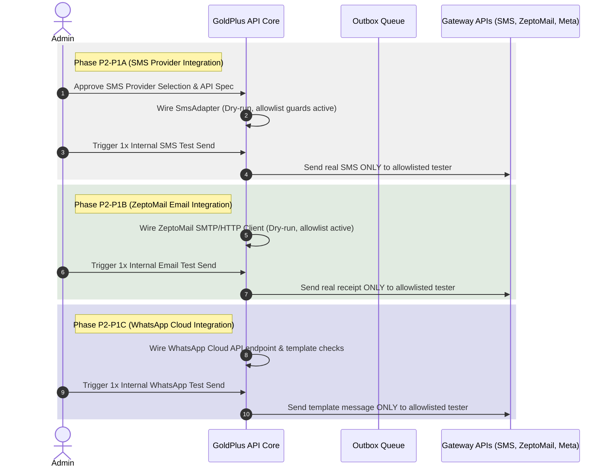

# GoldPlus Pass H1J-P0 — Customer Notifications & Communication Control Tower Design & Audit Plan

This document establishes the audit findings, design baseline, and implementation details for Phase 1 Customer Notifications, WhatsApp Handoffs, Email Receipts, and Support Messaging (`H1J-P1`).

---

## 1. Existing Communication Architecture Audit

Our codebase audit verified the following existing messaging and notification infrastructure:

### 1.1 Outbox & Process Outbox Batch Usecase
*   **Outbox Persistence**: The database schema in `apps/api/src/infrastructure/db/schema/system.ts` defines the `outbox_events` table (featuring columns `eventType`, `payload`, `isProcessed`, `processedAt`, `attemptCount`, `lastError`, `nextAttemptAt`).
*   **Outbox Processing**: Exists inside `ProcessOutboxBatchUseCase.ts` (`apps/api/src/application/use-cases/outbox/`). It claims unprocessed events, invokes `INotificationRouter.route()`, dispatches attempts through adapters, records attempts in `notification_attempts` database table via `RecordNotificationAttemptUseCase`, and manages exponential backoffs.

### 1.2 Multi-Channel Router and Adapters
*   **`DefaultNotificationRouter`**: In `apps/api/src/infrastructure/notifications/NotificationRouter.ts`, routes events (`PAYMENT_SUCCESS`, `PAYMENT_FAILED`, `DEALER_APPLICATION_SUBMITTED`, etc.) to specific targets.
*   **Multi-Channel Adapters**:
    *   **ZeptoMail (Email)** (`ZeptoMailAdapter.ts`): Read from `ZEPTOMAIL_API_TOKEN` and `ZEPTOMAIL_FROM_ADDRESS`, returning `NOT_CONFIGURED` gracefully without hitting external transports yet.
    *   **WhatsApp** (`WhatsAppAdapter.ts`): Read from `WHATSAPP_API_TOKEN` and `WHATSAPP_PHONE_NUMBER_ID`, returning `NOT_CONFIGURED` gracefully without hitting external targets.
    *   **SMS** (`DisabledSmsAdapter.ts`): Explicitly disabled in Phase 1 logic (`DisabledSmsAdapter` returns status `DISABLED`).

### 1.3 Customer Coordinates & Lifecycle States
*   **Buyer Data**: Order schemas map unmasked names, phones, emails, and delivery areas for shipping.
*   **Lifecycles**: Fulfillment states are strictly distinct from payment status (e.g. `orderStatus` transitions from `received` to `processing` while `paymentStatus` tracks `unpaid` -> `paid`).

---

## 2. Identified Gaps

1.  **No Automatic Order Communication Hooks**: The creation of an order or fulfillment state transitions do not automatically stage notification outbox records.
2.  **No Customer-Safe Templates**: Rendered notification templates are currently placeholders for admin notifications rather than clear customer-facing receipts.
3.  **Missing Frontend Communication Panel**: The admin details dashboard lacks a preview panel displaying mock emails, receipts, and WhatsApp message templates.
4.  **No Dynamic WhatsApp Link Builders**: Order-specific support coordinates are hardcoded rather than dynamically built, safe, and PII-masked.

---

## 3. Proposed H1J-P1 Scope

To bridge these gaps, we propose a provider-neutral notification template engine, order communication preview panel, and support WhatsApp handoff builders:

### 3.1 Template Catalog and Rendering Engine
We will implement `NotificationTemplateRenderer` supporting text and HTML templates:
1.  `ORDER_RECEIVED_UNPAID`: Order submitted safely. Status is **Unpaid**. Instructs to proceed with payment.
2.  `ORDER_PAYMENT_PENDING`: Payment initiated but pending validation.
3.  `ORDER_PAYMENT_SUCCESS`: Payment verified. Transitions order to **Processing**.
4.  `ORDER_PAYMENT_FAILED`: Payment failed. Suggests retrying payment.
5.  `ORDER_PAYMENT_CANCELLED`: Checkout cancelled by buyer.
6.  `ORDER_FULFILLMENT_PROCESSING`: Dispatch preparation in progress.
7.  `ORDER_FULFILLMENT_COMPLETED`: Handover successful.
8.  `SUPPORT_WHATSAPP_TEMPLATED`: Safe client message format.

### 3.2 WhatsApp Customer Trust & PII Isolation
WhatsApp URL handoffs must protect buyer coordinates:
*   **PII Masking**: Custom WhatsApp support links will **never** encode customer emails, full delivery addresses, or coordinates in query strings.
*   **Format**: Builds links using `https://wa.me/256000000000?text=Hello%20GoldPlus,%20I'm%20inquiring%20about%20order%20[ORDER_NUMBER]`.

### 3.3 Admin details Communication Preview Panel
Add a beautiful tabbed tab/panel to `apps/web/src/pages/admin/orders/[id].astro` allowing agents to review:
1.  **Astro Customer Email Preview**: Full mock HTML receipt including order lines and delivery summary.
2.  **WhatsApp Handoff Preview**: Copyable template text to initiate chat with the customer.
*Note: No manual paid button or fake success copy will exist in details pages or email receipt designs.*

---

## 4. Protected Areas (No-Touch)

The following components must remain completely frozen:
*   `apps/web/src/components/recommendations/` — Frozen
*   `apps/web/src/pages/admin/recommendations/` — Frozen
*   `apps/web/src/pages/admin/merchandising/` — Frozen
*   `apps/web/src/pages/admin/settings/` — Frozen
*   `apps/web/src/lib/homepage-merchandising.ts` — Frozen
*   `apps/web/src/lib/returning-user.ts` — Frozen
*   `apps/web/src/components/Header.astro` — Frozen
*   `apps/web/src/pages/shop.astro` — Frozen
*   `apps/web/src/pages/admin/products/` — Frozen

---

## 5. Testing and Validation Plan

1.  `NotificationTemplate.test.ts`: Verify that unpaid orders never render with "Payment successful" copy.
2.  `WhatsAppUrlSafety.test.ts`: Verify that WhatsApp URLs do not leak customer email, phone, or delivery landmark address.
3.  `AdminPreviewAuth.test.ts`: Verify that email and WhatsApp previews require valid admin credentials.
4.  `Quality Gates`: Ensure all type checks, unit tests, and build cycles pass with zero errors.

---

## 6. Rollback and Contingency Plan

1.  **Immediate Reversion**: Revert to the locked release tag `order-operations-admin-h1i-p1-r1`.
2.  **State Reset**: Since H1J-P1 runs with zero schema migrations, code rollbacks will immediately restore system baseline sanity.

---

## 7. GoldPlus Pass H1J-P2-P0 — Notification Provider Activation Planning Audit

This section documents the formal architectural blueprint and readiness audit for the multi-channel notification activation phase.

### 7.1 Gaps & Acceptance Status
*   **H1J-P1-R1 Acceptance Result:** **Accepted and Locked.** The template engine, order communication previews, dynamic safe support WhatsApp generation, HTML customer-controlled value escaping, and iframe sandboxing security safeguards are fully implemented, verified, and tagged as `customer-notifications-h1j-p1-r1`.
*   **Provider Priority Decision:**
    1.  **SMS first** (`H1J-P2-P1A`): Simple, text-only, low-overhead, and high-impact. Easiest channel to validate securely before moving to rich HTML.
    2.  **ZeptoMail second** (`H1J-P2-P1B`): Email receipts require structured HTML styling, verified sender domains, bounce handling, and reply-to routing.
    3.  **WhatsApp later** (`H1J-P2-P1C`): Retained as the last phase due to complex dependencies on Meta Business verification, API namespace templates, strict opt-in guidelines, and 24-hour messaging window rules.

---

### 7.2 Current Provider Architecture Audit

A workspace code audit verified the following status of providers and components:

| Provider / Adapter | Location | Status | Current Behavior | live send path reachable? |
| :--- | :--- | :--- | :--- | :--- |
| **SMS** | `apps/api/src/infrastructure/notifications/sms/DisabledSmsAdapter.ts` | **Disabled** | Returns static `status: 'DISABLED'` with code `CHANNEL_DISABLED`. | **No.** Completely stubbed, zero outbound network capability. |
| **ZeptoMail** | `apps/api/src/infrastructure/notifications/zeptomail/ZeptoMailAdapter.ts` | **Stubbed** | Verifies token presence, returns `status: 'NOT_CONFIGURED'` with code `PROVIDER_NOT_WIRED`. | **No.** No SMTP or HTTP REST transport Client is wired. |
| **WhatsApp** | `apps/api/src/infrastructure/notifications/whatsapp/WhatsAppAdapter.ts` | **Stubbed** | Verifies token presence, returns `status: 'NOT_CONFIGURED'` with code `PROVIDER_NOT_WIRED`. | **No.** No Meta Graph Cloud API routing is wired. |

*   **Notification Router (`NotificationRouter.ts`):** Routes `PAYMENT_SUCCESS`, `PAYMENT_FAILED`, `DEALER_APPLICATION_SUBMITTED`, `QUOTE_REQUESTED`, and `FAKE_PRODUCT_REPORTED` events to system operational alerts (`OPS_ALERT_EMAIL` / `OPS_ALERT_WHATSAPP`) and resolves them to the registered adapters.
*   **Outbox Processing (`ProcessOutboxBatchUseCase.ts`):** Claims unprocessed events, routes target channels, triggers adapter dispatching, and logs attempts in `notification_attempts` table. It manages safe retry logic (maximum of 8 attempts) using exponential backoff.
*   **Notification Attempt Logging (`RecordNotificationAttemptUseCase.ts` & `phase11.ts`):** Records structured send logs to the append-only `notification_attempts` schema (storing channel, recipient, template, status, provider codes, and related order entities).

---

### 7.3 Secure Credential Intake Checklist

To prevent API credential leakage, the following environment variables will be injected at runtime only. **No credentials will be hardcoded, committed to git, or requested in development chats.**

```bash
# ==============================================================================
# GOLDPLUS COMMUNICATIONS CONFIGURATION (PLACEHOLDERS ONLY)
# ==============================================================================

# Global Send Controls
NOTIFICATIONS_DRY_RUN=true
NOTIFICATIONS_LIVE_SEND_ENABLED=false
NOTIFICATIONS_ALLOWED_TEST_RECIPIENTS=

# 1. SMS Provider (Phase P2-P1A)
SMS_PROVIDER=
SMS_BASE_URL=
SMS_API_KEY=
SMS_SENDER_ID=
SMS_DEFAULT_COUNTRY_CODE=UG
NOTIFICATIONS_SMS_ENABLED=false

# 2. ZeptoMail Email Receipts (Phase P2-P1B)
ZEPTOMAIL_API_TOKEN=
ZEPTOMAIL_FROM_ADDRESS=
ZEPTOMAIL_FROM_NAME="GoldPlus"
ZEPTOMAIL_REPLY_TO=
NOTIFICATIONS_EMAIL_ENABLED=false

# 3. WhatsApp Cloud API (Phase P2-P1C)
WHATSAPP_API_TOKEN=
WHATSAPP_PHONE_NUMBER_ID=
WHATSAPP_BUSINESS_ACCOUNT_ID=
WHATSAPP_API_VERSION=
WHATSAPP_DEFAULT_COUNTRY_CODE=UG
NOTIFICATIONS_WHATSAPP_ENABLED=false
```

---

### 7.4 Global Safety & Outbox Delivery Model

To ensure absolute safety during the rollout of live providers, the following multi-tiered guard framework is established:



1.  **Dry-Run-by-Default:** By default, all notification dispatches render the corresponding template, compile the text, log the parameters to safe local console logs, and bypass any outgoing third-party API hits. The transaction outbox event is marked as successfully processed with a dry-run flag.
2.  **Live-Send-Disabled-by-Default:** Adapters will actively check `NOTIFICATIONS_LIVE_SEND_ENABLED` and `NOTIFICATIONS_DRY_RUN`. Unless live send is explicitly true and dry-run is false, zero HTTP requests will exit the server.
3.  **Test-Recipient Allowlist Model:** During pre-production phases, only messages destined for addresses or phone numbers defined in `NOTIFICATIONS_ALLOWED_TEST_RECIPIENTS` are permitted to execute real network requests. All others are gracefully intercepted, logged, and marked dry-run.
4.  **Outbox Safety & Anti-Spam Limits:** The `ProcessOutboxBatchUseCase` handles retries automatically with progressive exponential backoffs. However, should an adapter return a permanent error (e.g. invalid recipient formatting) or exceed 8 maximum retry loops, the record is permanently retired with status `ABORTED` to prevent gateway billing spam or infinite-loop fires.

---

### 7.5 Provider Health-Check & Diagnostic Plan

*   **Endpoint:** Implement `GET /admin/api/notifications/health-check` (strictly protected by authentication and limited to administrators).
*   **Operational Checks:**
    *   **Ping Test:** Trigger low-overhead API connection tests (such as resolving target URLs, executing zero-cost credential validations, or querying token info/limits) without dispatching any customer communications.
    *   **Status Report:** Return clean JSON indicating reachable/unreachable states, current rate-limit capacities, and config sanitization checks.

---

### 7.6 Phased Rollout Plan



---

### 7.7 Testing & Quality Assurance Plan

1.  **Automated Unit Tests:**
    *   **Safety Interceptor Tests:** Validate that adapters immediately return `DRY_RUN_SUCCESS` or intercept payloads if recipient is not in `NOTIFICATIONS_ALLOWED_TEST_RECIPIENTS`.
    *   **Mock Dispatch Tests:** Test adapters with full integration mocks (using `nock` or vitest mock functions) simulating HTTP 200 (Success), 400 (Invalid Formatting), 401 (Unauthorized Token), and 429 (Rate-Limit Exceeded) to ensure strict response handling and error sanitization.
2.  **Manual QA:**
    *   Initialize local workspace server with `NOTIFICATIONS_DRY_RUN=true` and confirm no HTTP requests are triggered during checkout or order updates.
    *   Add personal test numbers/emails to `NOTIFICATIONS_ALLOWED_TEST_RECIPIENTS`, switch dry-run off for testing, and execute internal test triggers to verify layout and delivery.
3.  **Remaining Risks:**
    *   *Rate Limits:* Bulk sending might trigger temporary throttling. Adapters will return typed `429` statuses to prompt outbox backoff retries.
    *   *Formatting Variations:* Client numbers might miss international dialing codes. The SMS adapter will implement basic Ugandan formatting standardizations (`07...` -> `+2567...`).
    *   *No blocking risks remain for this planning phase.*

---

### 7.8 Recommended Next Step

Proceed with **GoldPlus Pass H1J-P2-P1A — SMS Provider Secure Credential Intake, Dry-Run Dispatch, Health Check, and Internal Test Send Gate**. The execution will commence only after the user confirms the designated SMS provider name and API details.

---
