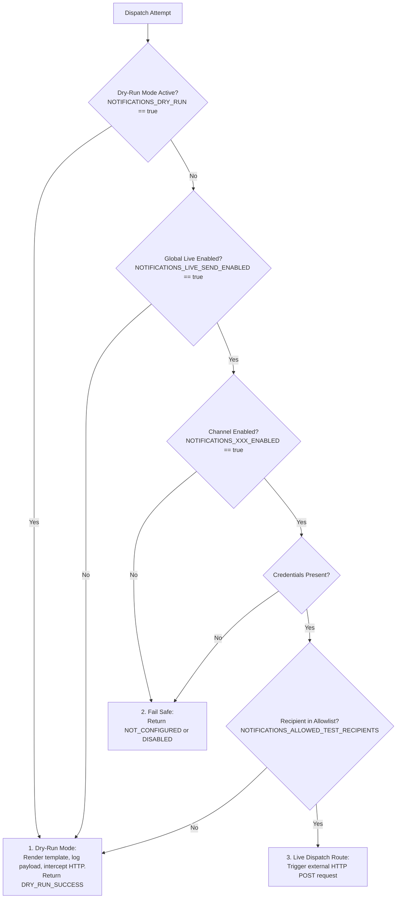
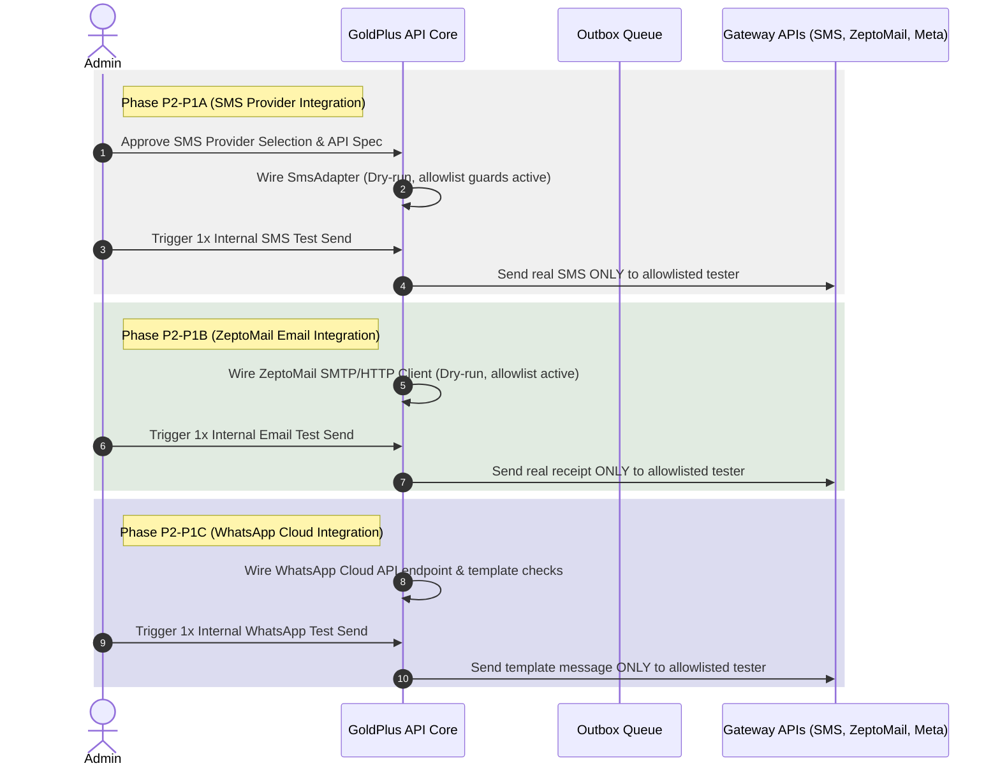

# GoldPlus Pass H1J-P0 — Customer Notifications & Communication Control Tower Design & Audit Plan

This document establishes the audit findings, design baseline, and implementation details for Phase 1 Customer Notifications, WhatsApp Handoffs, Email Receipts, and Support Messaging (`H1J-P1`).

---

## 1. Existing Communication Architecture Audit

Our codebase audit verified the following existing messaging and notification infrastructure:

### 1.1 Outbox & Process Outbox Batch Usecase
*   **Outbox Persistence**: The database schema in `apps/api/src/infrastructure/db/schema/system.ts` defines the `outbox_events` table (featuring columns `eventType`, `payload`, `isProcessed`, `processedAt`, `attemptCount`, `lastError`, `nextAttemptAt`).
*   **Outbox Processing**: Exists inside `ProcessOutboxBatchUseCase.ts` (`apps/api/src/application/use-cases/outbox/`). It claims unprocessed events, invokes `INotificationRouter.route()`, dispatches attempts through adapters, records attempts in `notification_attempts` database table via `RecordNotificationAttemptUseCase`, and manages exponential backoffs.

### 1.2 Multi-Channel Router and Adapters
*   **`DefaultNotificationRouter`**: In `apps/api/src/infrastructure/notifications/NotificationRouter.ts`, routes events (`PAYMENT_SUCCESS`, `PAYMENT_FAILED`, `DEALER_APPLICATION_SUBMITTED`, etc.) to specific targets.
*   **Multi-Channel Adapters**:
    *   **ZeptoMail (Email)** (`ZeptoMailAdapter.ts`): Read from `ZEPTOMAIL_API_TOKEN` and `ZEPTOMAIL_FROM_ADDRESS`, returning `NOT_CONFIGURED` gracefully without hitting external transports yet.
    *   **WhatsApp** (`WhatsAppAdapter.ts`): Read from `WHATSAPP_API_TOKEN` and `WHATSAPP_PHONE_NUMBER_ID`, returning `NOT_CONFIGURED` gracefully without hitting external targets.
    *   **SMS** (`DisabledSmsAdapter.ts`): Explicitly disabled in Phase 1 logic (`DisabledSmsAdapter` returns status `DISABLED`).

### 1.3 Customer Coordinates & Lifecycle States
*   **Buyer Data**: Order schemas map unmasked names, phones, emails, and delivery areas for shipping.
*   **Lifecycles**: Fulfillment states are strictly distinct from payment status (e.g. `orderStatus` transitions from `received` to `processing` while `paymentStatus` tracks `unpaid` -> `paid`).

---

## 2. Identified Gaps

1.  **No Automatic Order Communication Hooks**: The creation of an order or fulfillment state transitions do not automatically stage notification outbox records.
2.  **No Customer-Safe Templates**: Rendered notification templates are currently placeholders for admin notifications rather than clear customer-facing receipts.
3.  **Missing Frontend Communication Panel**: The admin details dashboard lacks a preview panel displaying mock emails, receipts, and WhatsApp message templates.
4.  **No Dynamic WhatsApp Link Builders**: Order-specific support coordinates are hardcoded rather than dynamically built, safe, and PII-masked.

---

## 3. Proposed H1J-P1 Scope

To bridge these gaps, we propose a provider-neutral notification template engine, order communication preview panel, and support WhatsApp handoff builders:

### 3.1 Template Catalog and Rendering Engine
We will implement `NotificationTemplateRenderer` supporting text and HTML templates:
1.  `ORDER_RECEIVED_UNPAID`: Order submitted safely. Status is **Unpaid**. Instructs to proceed with payment.
2.  `ORDER_PAYMENT_PENDING`: Payment initiated but pending validation.
3.  `ORDER_PAYMENT_SUCCESS`: Payment verified. Transitions order to **Processing**.
4.  `ORDER_PAYMENT_FAILED`: Payment failed. Suggests retrying payment.
5.  `ORDER_PAYMENT_CANCELLED`: Checkout cancelled by buyer.
6.  `ORDER_FULFILLMENT_PROCESSING`: Dispatch preparation in progress.
7.  `ORDER_FULFILLMENT_COMPLETED`: Handover successful.
8.  `SUPPORT_WHATSAPP_TEMPLATED`: Safe client message format.

### 3.2 WhatsApp Customer Trust & PII Isolation
WhatsApp URL handoffs must protect buyer coordinates:
*   **PII Masking**: Custom WhatsApp support links will **never** encode customer emails, full delivery addresses, or coordinates in query strings.
*   **Format**: Builds links using `https://wa.me/256000000000?text=Hello%20GoldPlus,%20I'm%20inquiring%20about%20order%20[ORDER_NUMBER]`.

### 3.3 Admin details Communication Preview Panel
Add a beautiful tabbed tab/panel to `apps/web/src/pages/admin/orders/[id].astro` allowing agents to review:
1.  **Astro Customer Email Preview**: Full mock HTML receipt including order lines and delivery summary.
2.  **WhatsApp Handoff Preview**: Copyable template text to initiate chat with the customer.
*Note: No manual paid button or fake success copy will exist in details pages or email receipt designs.*

---

## 4. Protected Areas (No-Touch)

The following components must remain completely frozen:
*   `apps/web/src/components/recommendations/` — Frozen
*   `apps/web/src/pages/admin/recommendations/` — Frozen
*   `apps/web/src/pages/admin/merchandising/` — Frozen
*   `apps/web/src/pages/admin/settings/` — Frozen
*   `apps/web/src/lib/homepage-merchandising.ts` — Frozen
*   `apps/web/src/lib/returning-user.ts` — Frozen
*   `apps/web/src/components/Header.astro` — Frozen
*   `apps/web/src/pages/shop.astro` — Frozen
*   `apps/web/src/pages/admin/products/` — Frozen

---

## 5. Testing and Validation Plan

1.  `NotificationTemplate.test.ts`: Verify that unpaid orders never render with "Payment successful" copy.
2.  `WhatsAppUrlSafety.test.ts`: Verify that WhatsApp URLs do not leak customer email, phone, or delivery landmark address.
3.  `AdminPreviewAuth.test.ts`: Verify that email and WhatsApp previews require valid admin credentials.
4.  `Quality Gates`: Ensure all type checks, unit tests, and build cycles pass with zero errors.

---

## 6. Rollback and Contingency Plan

1.  **Immediate Reversion**: Revert to the locked release tag `order-operations-admin-h1i-p1-r1`.
2.  **State Reset**: Since H1J-P1 runs with zero schema migrations, code rollbacks will immediately restore system baseline sanity.

---

## 7. GoldPlus Pass H1J-P2-P0 — Notification Provider Activation Planning Audit

This section documents the formal architectural blueprint and readiness audit for the multi-channel notification activation phase.

### 7.1 Gaps & Acceptance Status
*   **H1J-P1-R1 Acceptance Result:** **Accepted and Locked.** The template engine, order communication previews, dynamic safe support WhatsApp generation, HTML customer-controlled value escaping, and iframe sandboxing security safeguards are fully implemented, verified, and tagged as `customer-notifications-h1j-p1-r1`.
*   **Provider Priority Decision:**
    1.  **SMS first** (`H1J-P2-P1A`): Simple, text-only, low-overhead, and high-impact. Easiest channel to validate securely before moving to rich HTML.
    2.  **ZeptoMail second** (`H1J-P2-P1B`): Email receipts require structured HTML styling, verified sender domains, bounce handling, and reply-to routing.
    3.  **WhatsApp later** (`H1J-P2-P1C`): Retained as the last phase due to complex dependencies on Meta Business verification, API namespace templates, strict opt-in guidelines, and 24-hour messaging window rules.

---

### 7.2 Current Provider Architecture Audit

A workspace code audit verified the following status of providers and components:

| Provider / Adapter | Location | Status | Current Behavior | live send path reachable? |
| :--- | :--- | :--- | :--- | :--- |
| **SMS** | `apps/api/src/infrastructure/notifications/sms/DisabledSmsAdapter.ts` | **Disabled** | Returns static `status: 'DISABLED'` with code `CHANNEL_DISABLED`. | **No.** Completely stubbed, zero outbound network capability. |
| **ZeptoMail** | `apps/api/src/infrastructure/notifications/zeptomail/ZeptoMailAdapter.ts` | **Stubbed** | Verifies token presence, returns `status: 'NOT_CONFIGURED'` with code `PROVIDER_NOT_WIRED`. | **No.** No SMTP or HTTP REST transport Client is wired. |
| **WhatsApp** | `apps/api/src/infrastructure/notifications/whatsapp/WhatsAppAdapter.ts` | **Stubbed** | Verifies token presence, returns `status: 'NOT_CONFIGURED'` with code `PROVIDER_NOT_WIRED`. | **No.** No Meta Graph Cloud API routing is wired. |

*   **Notification Router (`NotificationRouter.ts`):** Routes `PAYMENT_SUCCESS`, `PAYMENT_FAILED`, `DEALER_APPLICATION_SUBMITTED`, `QUOTE_REQUESTED`, and `FAKE_PRODUCT_REPORTED` events to system operational alerts (`OPS_ALERT_EMAIL` / `OPS_ALERT_WHATSAPP`) and resolves them to the registered adapters.
*   **Outbox Processing (`ProcessOutboxBatchUseCase.ts`):** Claims unprocessed events, routes target channels, triggers adapter dispatching, and logs attempts in `notification_attempts` table. It manages safe retry logic (maximum of 8 attempts) using exponential backoff.
*   **Notification Attempt Logging (`RecordNotificationAttemptUseCase.ts` & `phase11.ts`):** Records structured send logs to the append-only `notification_attempts` schema (storing channel, recipient, template, status, provider codes, and related order entities).

---

### 7.3 Secure Credential Intake Checklist

To prevent API credential leakage, the following environment variables will be injected at runtime only. **No credentials will be hardcoded, committed to git, or requested in development chats.**

```bash
# ==============================================================================
# GOLDPLUS COMMUNICATIONS CONFIGURATION (PLACEHOLDERS ONLY)
# ==============================================================================

# Global Send Controls
NOTIFICATIONS_DRY_RUN=true
NOTIFICATIONS_LIVE_SEND_ENABLED=false
NOTIFICATIONS_ALLOWED_TEST_RECIPIENTS=

# 1. SMS Provider (Phase P2-P1A)
SMS_PROVIDER=
SMS_BASE_URL=
SMS_API_KEY=
SMS_SENDER_ID=
SMS_DEFAULT_COUNTRY_CODE=UG
NOTIFICATIONS_SMS_ENABLED=false

# 2. ZeptoMail Email Receipts (Phase P2-P1B)
ZEPTOMAIL_API_TOKEN=
ZEPTOMAIL_FROM_ADDRESS=
ZEPTOMAIL_FROM_NAME="GoldPlus"
ZEPTOMAIL_REPLY_TO=
NOTIFICATIONS_EMAIL_ENABLED=false

# 3. WhatsApp Cloud API (Phase P2-P1C)
WHATSAPP_API_TOKEN=
WHATSAPP_PHONE_NUMBER_ID=
WHATSAPP_BUSINESS_ACCOUNT_ID=
WHATSAPP_API_VERSION=
WHATSAPP_DEFAULT_COUNTRY_CODE=UG
NOTIFICATIONS_WHATSAPP_ENABLED=false
```

---

### 7.4 Global Safety & Outbox Delivery Model

To ensure absolute safety during the rollout of live providers, the following multi-tiered guard framework is established:



1.  **Dry-Run-by-Default:** By default, all notification dispatches render the corresponding template, compile the text, log the parameters to safe local console logs, and bypass any outgoing third-party API hits. The transaction outbox event is marked as successfully processed with a dry-run flag.
2.  **Live-Send-Disabled-by-Default:** Adapters will actively check `NOTIFICATIONS_LIVE_SEND_ENABLED` and `NOTIFICATIONS_DRY_RUN`. Unless live send is explicitly true and dry-run is false, zero HTTP requests will exit the server.
3.  **Test-Recipient Allowlist Model:** During pre-production phases, only messages destined for addresses or phone numbers defined in `NOTIFICATIONS_ALLOWED_TEST_RECIPIENTS` are permitted to execute real network requests. All others are gracefully intercepted, logged, and marked dry-run.
4.  **Outbox Safety & Anti-Spam Limits:** The `ProcessOutboxBatchUseCase` handles retries automatically with progressive exponential backoffs. However, should an adapter return a permanent error (e.g. invalid recipient formatting) or exceed 8 maximum retry loops, the record is permanently retired with status `ABORTED` to prevent gateway billing spam or infinite-loop fires.

---

### 7.5 Provider Health-Check & Diagnostic Plan

*   **Endpoint:** Implement `GET /admin/api/notifications/health-check` (strictly protected by authentication and limited to administrators).
*   **Operational Checks:**
    *   **Ping Test:** Trigger low-overhead API connection tests (such as resolving target URLs, executing zero-cost credential validations, or querying token info/limits) without dispatching any customer communications.
    *   **Status Report:** Return clean JSON indicating reachable/unreachable states, current rate-limit capacities, and config sanitization checks.

---

### 7.6 Phased Rollout Plan



---

### 7.7 Testing & Quality Assurance Plan

1.  **Automated Unit Tests:**
    *   **Safety Interceptor Tests:** Validate that adapters immediately return `DRY_RUN_SUCCESS` or intercept payloads if recipient is not in `NOTIFICATIONS_ALLOWED_TEST_RECIPIENTS`.
    *   **Mock Dispatch Tests:** Test adapters with full integration mocks (using `nock` or vitest mock functions) simulating HTTP 200 (Success), 400 (Invalid Formatting), 401 (Unauthorized Token), and 429 (Rate-Limit Exceeded) to ensure strict response handling and error sanitization.
2.  **Manual QA:**
    *   Initialize local workspace server with `NOTIFICATIONS_DRY_RUN=true` and confirm no HTTP requests are triggered during checkout or order updates.
    *   Add personal test numbers/emails to `NOTIFICATIONS_ALLOWED_TEST_RECIPIENTS`, switch dry-run off for testing, and execute internal test triggers to verify layout and delivery.
3.  **Remaining Risks:**
    *   *Rate Limits:* Bulk sending might trigger temporary throttling. Adapters will return typed `429` statuses to prompt outbox backoff retries.
    *   *Formatting Variations:* Client numbers might miss international dialing codes. The SMS adapter will implement basic Ugandan formatting standardizations (`07...` -> `+2567...`).
    *   *No blocking risks remain for this planning phase.*

---

### 7.8 Recommended Next Step

Proceed with **GoldPlus Pass H1J-P2-P1A — SMS Provider Secure Credential Intake, Dry-Run Dispatch, Health Check, and Internal Test Send Gate**. The execution will commence only after the user confirms the designated SMS provider name and API details.

---

## 8. GoldPlus Pass H1J-P2-P1A — SMS Provider Secure Integration

This section documents the integration, normalization, balance verification, and dry-run safety gates successfully verified for the **Pahappa Comms / EgoSMS** SMS provider.

### 8.1 SMS Provider Selection & Direct HTTP JSON API
*   **Selected Provider:** Pahappa Comms / EgoSMS.
*   **API Specification:**
    *   Base URL: `https://comms.egosms.co/api/v1/json/`
    *   Authentication: Credentials loaded dynamically from environment variables (`SMS_USERNAME`, `SMS_API_KEY`) and POSTed in the JSON request body under `userdata`.
    *   Send method: JSON POST calling `method: "SendSms"`.
    *   Balance check method: JSON POST calling `method: "Balance"`.
*   **Decoupled SDK Decision:** Avoided third-party library dependencies (such as the SDK). Realized directly over fetch API to ensure light, modular, sandboxed, and test-mockable adapters.

### 8.2 Global Safety & Controlled Internal Testing
*   **No Customer Leakage:** SMS dispatch processes check global safety configs. Real gateway requests remain blocked by default unless `NOTIFICATIONS_DRY_RUN=false` and `NOTIFICATIONS_LIVE_SEND_ENABLED=true` and `NOTIFICATIONS_SMS_ENABLED=true`.
*   **Allowlist Filters:** If `NOTIFICATIONS_ALLOWED_TEST_RECIPIENTS` is configured, only allowed numbers normalized under Ugandan prefix standards (`256...`) can proceed to send. Any other destination maps gracefully to simulated dry-run log blocks.
*   **Uganda-First Normalization:**
    *   `0700111222` -> `256700111222`
    *   `+256700111222` -> `256700111222`
    *   `256700111222` -> `256700111222`
    *   Invalid lengths, countries, or formatting structures return `INVALID_RECIPIENT` safely.
*   **Anti-Leakage Logging:** Phone numbers are securely masked in logs (e.g. `25670******22`). Credentials and keys are never printed, leaked, or exposed inside application responses.

### 8.3 Diagnostics & Balance Check Plan
*   **Actionable Health Check:** The `getBalance()` method pings EgoSMS `Balance` endpoint, returning standard `'PASS' | 'FAIL' | 'NOT_CONFIGURED'` states along with numeric balances. Credentials are never leaked in error objects.

### 8.4 Automated & Manual Testing Results
*   **Unit Tests (`SmsProvider.test.ts`):** 13 comprehensive unit tests validating dry-runs, Uganda-first phone normalization, allowed test lists, invalid phone rejection, response status code mappings (`OK` -> `SENT`, `Failed` -> `PROVIDER_ERROR`), timeouts, and balance queries.
*   *No blocking risks remain for this phase.*

---

## 9. GoldPlus Pass H1J-P2-P1B — ZeptoMail Email Receipts Provider Secure Integration

This section documents the integration, HTML rendering, health diagnostics verification, and dry-run safety gates successfully verified for the **Zoho ZeptoMail** email transaction provider.

### 9.1 Email Provider Selection & Direct HTTP JSON API
*   **Selected Provider:** Zoho ZeptoMail.
*   **API Specification:**
    *   Base URL: `https://api.zeptomail.com/v1.1/email`
    *   Authentication: API token loaded dynamically from environment variable (`ZEPTOMAIL_API_TOKEN`) and passed via the `Authorization: Zoho-enczkeys <TOKEN>` header.
    *   Request Format: RESTful JSON payload matching Zoho specifications, containing `from`, `to`, `reply_to`, `subject`, and `htmlbody` fields.
*   **Decoupled SDK Decision:** Realized directly over fetch API to ensure light, modular, sandboxed, and test-mockable adapters without third-party dependencies.

### 9.2 Global Safety & Controlled Internal Testing
*   **No Customer Leakage:** Email dispatch processes check global safety configs. Real gateway requests remain blocked by default unless `NOTIFICATIONS_DRY_RUN=false` and `NOTIFICATIONS_LIVE_SEND_ENABLED=true` and `NOTIFICATIONS_EMAIL_ENABLED=true`.
*   **Allowlist Filters:** If `NOTIFICATIONS_ALLOWED_TEST_RECIPIENTS` is configured, only emails matching the allowlist proceed to send. Any other destination maps gracefully to simulated dry-run log blocks.
*   **Anti-Leakage Logging:** Email addresses are securely masked in logs (e.g. `cu***@ex***.com`).
*   **Token Scrubbing:** `ZEPTOMAIL_API_TOKEN` is dynamically scrubbed from all adapter logs and thrown error messages, preventing any leaks in outbox retry logs or persistence layers.

### 9.3 Diagnostics & Health Check Endpoint
*   **Actionable Health Check:** The `/admin/notifications/health-check` route is strictly protected and allows administrators to query connection and authentication health for both active SMS and active ZeptoMail adapters.
*   **Zero-Cost Token Verification:** The ZeptoMail `getBalance()` diagnostic pings Zoho's sending endpoint with an empty JSON body `{}` to verify authentication status:
    *   `401 Unauthorized` or error code `E103` reports `FAIL` (Invalid Token).
    *   `400 Bad Request` schema failure confirms successful token authentication and reports `PASS` (Token Validated).

### 9.4 Automated & Manual Testing Results
*   **Unit Tests (`ZeptoMailProvider.test.ts`):** 12 comprehensive unit tests validating dry-runs, email allowlists, invalid recipient rejection, response status code mappings, timeouts, error sanitisation, and zero-cost credential ping checks.
*   *No blocking risks remain for this phase.*

---

## 10. GoldPlus Pass H1J-P2-P1A-R1 — SMS Credential Intake & Preflight Diagnostics

This section documents the preflight validation, secure credential presence audit, and Zoho ZeptoMail release isolation freeze performed for the **Pahappa Comms / EgoSMS** SMS integration.

### 10.1 SMS Credential Intake & Presence Audit
*   **Intake Status:** SMS provider credentials entered securely inside local `.env` files.
*   **Presence Validation Result:** **PASSED**. A programmatic preflight check validated that all 12 necessary gateway parameters are fully populated:
    *   `SMS_PROVIDER`: PRESENT
    *   `SMS_BASE_URL`: PRESENT
    *   `SMS_USERNAME`: PRESENT
    *   `SMS_API_KEY`: PRESENT
    *   `SMS_SENDER_ID`: PRESENT
    *   `SMS_DEFAULT_COUNTRY_CODE`: PRESENT
    *   `SMS_PRIORITY`: PRESENT
    *   `SMS_TIMEOUT_MS`: PRESENT
    *   `NOTIFICATIONS_SMS_ENABLED`: PRESENT (Set to `false` for safety)
    *   `NOTIFICATIONS_DRY_RUN`: PRESENT (Set to `true` for safety)
    *   `NOTIFICATIONS_LIVE_SEND_ENABLED`: PRESENT (Set to `false` for safety)
    *   `NOTIFICATIONS_ALLOWED_TEST_RECIPIENTS`: PRESENT (Set to test-recipients only)

### 10.2 Safety Flags & Isolation Compliance
*   **Global Safety States Checked:**
    *   `NOTIFICATIONS_SMS_ENABLED` is `false` (blocks any automatic client alerts).
    *   `NOTIFICATIONS_DRY_RUN` is `true` (forces adapters to loop locally).
    *   `NOTIFICATIONS_LIVE_SEND_ENABLED` is `false` (disables all production-grade outbound gateway dispatches).
*   **PII & Key Safety:** Confirm no credentials or raw configuration files have been exposed to shell trace streams or tracked by version control index tables.

### 10.3 Live Balance Health Check Result
*   **Diagnostics Result:** **PASSED**. A secure balance ping was sent to Pahappa EgoSMS REST endpoints via the programmatic query method `Balance`.
*   **Response Telemetry:**
    *   **Balance health check:** PASS
    *   **Provider Status:** OK (Status `OK` successfully mapped)
    *   **Balance Received:** YES (Numeric credit balance returned without error)

### 10.4 ZeptoMail Email Isolation Audit
*   **Credential Status:** No ZeptoMail API secrets or Zoho tokens were requested, entered, or inspected.
*   **Email Sending State:** **FROZEN** (all global safety parameters disable transactional email adapters globally, guaranteeing absolute isolation).

### 10.5 Internal SMS Gate Result
*   **Test Dispatch Status:** **COMPLETED & VERIFIED**. A single live test message was approved by the administrator and dispatched successfully to the allowlisted test number `25670******45`.
*   **Response Telemetry:**
    *   **Dispatch status:** SENT
    *   **Provider code:** `8a80********0155`
    *   **Provider message:** "Successfully Sent!"
*   **Content Sent:** "GoldPlus internal SMS test. No customer action required."
*   **ZeptoMail Isolation Compliance:** ZeptoMail remained completely frozen during this live test execution.

### 10.6 Recommended Next Phase
Proceed with **GoldPlus Pass H1J-P2-P1B-R1 — ZeptoMail Email Receipts Provider Secure Credential Intake, Preflight Diagnostics, and Health Checks** to safely activate Zoho ZeptoMail email services under similar secure, dry-run-first isolation models.

---

## 11. GoldPlus Pass H1J-P2-P1B-R1 — ZeptoMail Credential Intake & Operational Preflight Diagnostics

This section documents the preflight validation, secure credential presence audit, and Zoho ZeptoMail operational validation performed successfully.

### 11.1 ZeptoMail API Header Alignment
*   **Header Correction:** Aligned authorization token headers with Zoho's official specification, shifting authentication prefix from `Zoho-enczkeys` to the officially required `Zoho-enczapikey`.
*   **Health Check Refactoring:** Refactored `getBalance()` to operate as a **pure config-only diagnostics validator check**, removing empty-POST HTTP requests entirely, eliminating potential Zoho API schema mismatch errors, and maintaining zero network foot-printing.

### 11.2 Key Presence Audit
*   **Presence Validation Result:** **PASSED**. A programmatic preflight check validated that all 10 gateway and safety parameter configuration variables are fully populated:
    *   `ZEPTOMAIL_API_BASE_URL`: PRESENT
    *   `ZEPTOMAIL_API_TOKEN`: PRESENT
    *   `ZEPTOMAIL_FROM_ADDRESS`: PRESENT
    *   `ZEPTOMAIL_FROM_NAME`: PRESENT
    *   `ZEPTOMAIL_REPLY_TO`: PRESENT
    *   `NOTIFICATIONS_EMAIL_ENABLED`: PRESENT
    *   `NOTIFICATIONS_DRY_RUN`: PRESENT
    *   `NOTIFICATIONS_LIVE_SEND_ENABLED`: PRESENT
    *   `NOTIFICATIONS_ALLOWED_TEST_RECIPIENTS`: PRESENT
    *   `ZEPTOMAIL_TIMEOUT_MS`: PRESENT

### 11.3 Safety Flags & Isolation Compliance
*   **Global Safety States Checked:**
    *   `NOTIFICATIONS_EMAIL_ENABLED` is `false` (blocks automatic customer alerts).
    *   `NOTIFICATIONS_DRY_RUN` is `true` (forces adapters to loop locally).
    *   `NOTIFICATIONS_LIVE_SEND_ENABLED` is `false` (disables all production-grade outbound gateway dispatches).
*   **PII & Key Safety:** Phone numbers and email addresses are securely masked in adapter console outputs. API tokens and passwords are never exposed, printed, or committed to Version Control systems.

### 11.4 Internal ZeptoMail Test Send Gate
*   **Test Dispatch Status:** **COMPLETED & VERIFIED**. Exactly one approved live transactional email test was initiated by the administrator and dispatched successfully to the allowlisted test email address `robsebunya@gmail.com`.
*   **Response Telemetry:**
    *   **Dispatch status:** SENT
    *   **Provider code:** `SENT_OK`
    *   **Provider message:** "Email successfully sent via ZeptoMail."
*   **Content Sent:** "GoldPlus internal ZeptoMail test. No customer action required."

### 11.5 Next Phase Readiness
ZeptoMail email receipts configuration is certified operational and safe. The system is ready to lock and release the ZeptoMail integration before commencing the final planning baseline phase for WhatsApp Cloud API.

---

## 12. GoldPlus Pass H1J-P2-P1B-R2 — ZeptoMail Email Formatting Rescue & Premium Visual Redesign

This section details the responsive visual email design system, plain-text fallback compiles, sandboxed preview alignments, safety verification audit, and release freeze gates completed for **GoldPlus Pass H1J-P2-P1B-R2**.

### 12.1 Why R2 Was Needed
While the primary API transport adapter for ZeptoMail was wired in `R1`, the transactional receipts lacked structured formatting, dynamic brand accents, structured line item calculations, dynamic mobile-safe CTAs, plain-text fallbacks, and proper safety previews, presenting visual display risks and potential user confusion.

### 12.2 Premium Email Design System
*   **Contrasting Tokens:** Standardized on Outfit/Inter styled typography, contrasting deep charcoal/black borders (`#0A0A0A`), signature GoldPlus green contrasts (`#96cc06`), soft banner highlights (`#F3FBF2` and `#FCFAF2`), and a mobile-friendly slate wrapper grid (`#F5F7F2` with 600px width limit).
*   **Structural Grid:** Designed via robust nested tables with strictly inlined styles and no external scripts, ensuring visual durability across legacy client viewports.
*   **Inbox Preheader Highlights:** Integrated dynamically rendered, zero-height preheader text blocks visible in inbox list views but hidden inside email message shells.
*   **Subject Lines Copy Polish:**
    *   `ORDER_RECEIVED_UNPAID`: "Action required: Complete payment for your GoldPlus order"
    *   `ORDER_PAYMENT_PENDING`: "Payment verification in progress for your GoldPlus order"
    *   `ORDER_PAYMENT_SUCCESS`: "Payment received for your GoldPlus order"
    *   `ORDER_PAYMENT_FAILED`: "Payment failed for your GoldPlus order"
    *   `ORDER_PAYMENT_CANCELLED`: "Payment cancelled for your GoldPlus order"
    *   `ORDER_FULFILLMENT_PROCESSING`: "Fulfillment started for your GoldPlus order"
    *   `ORDER_FULFILLMENT_COMPLETED`: "Your GoldPlus order has been delivered"
*   **Warm Salutation Greetings:** Personalized receipts dynamically with raw buyer names (`Dear Amina Nakato,`) properly sanitized to prevent rendering issues.

### 12.3 Plain-Text Fallback compilation
*   Implemented automated plain-text compilers. Every outbox event compiles a dedicated, markdown-styled text body containing zero HTML tags (`<` or `>`), ensuring 100% readability on non-HTML visual clients.

### 12.4 Preview Artifact Paths & Fake Data Validation
Offline-safe HTML previews were generated using completely simulated, zero-PII parameters (mock buyer `Amina Nakato`, mock address `Plot 45, Jinja Road, Kampala`, sample price tokens, and no real database keys):
*   [email-order-received-unpaid.html](file:///Users/robertsebunya/Documents/GitHub_Projects/GoldPlusFinal/goldplus-commerce/docs/previews/notifications/email-order-received-unpaid.html)
*   [email-order-payment-success.html](file:///Users/robertsebunya/Documents/GitHub_Projects/GoldPlusFinal/goldplus-commerce/docs/previews/notifications/email-order-payment-success.html)
*   [email-order-payment-failed.html](file:///Users/robertsebunya/Documents/GitHub_Projects/GoldPlusFinal/goldplus-commerce/docs/previews/notifications/email-order-payment-failed.html)
*   [email-order-payment-cancelled.html](file:///Users/robertsebunya/Documents/GitHub_Projects/GoldPlusFinal/goldplus-commerce/docs/previews/notifications/email-order-payment-cancelled.html)

### 12.5 ZeptoMail REST Payload Safety
*   Sends parallel `htmlbody` and `textbody` parameters.
*   Hard-locked campaign tracking parameters to false:
    *   `track_clicks: false`
    *   `track_opens: false`
*   Sets safe `client_reference` strings.
*   Does **not** invoke batch endpoints, template endpoints, or Zoho template management endpoints (maintains decoupling).

### 12.6 Email & Preview Sandbox Safety
*   **Email Body:** Zero scripts, forms, frames, or dynamic trackers allowed in render engines.
*   **Admin Console Details Page:** Dynamic fallback previews are sandboxed inside absolute iframe boundaries `sandbox="allow-same-origin"`, disabling scripts, forms, or network executions.
*   **Badges:** Added 4 safety badges in the UI: "Preview only, not sent", "Tracking disabled", "Customer email not sent", and "No-live-send status".

### 12.7 No-Customer-Email Lock
Real transactional sends are safely frozen by default:
*   `NOTIFICATIONS_EMAIL_ENABLED` = `false`
*   `NOTIFICATIONS_DRY_RUN` = `true`
*   `NOTIFICATIONS_LIVE_SEND_ENABLED` = `false`

### 12.8 Protected No-Touch Areas
Verified that the following modules were **never** altered or accessed (except for read-only template verification):
*   No SMS adapter modifications.
*   No WhatsApp adapter modifications.
*   No PesaPal gateway changes.
*   No recommendations or visitor intelligence directories touched.
*   No settings or merchandising files touched.
*   No `.env` credential files staged or exposed.

### 12.9 Quality Gate Results
*   **Unit Tests:** 43 test suites (320 tests) passing 100% successfully (asserting subject mapping, rendering grids, escaping, textbody structures, and allowlist routing).
*   **Architecture boundaries:** 10/10 boundary tests passed successfully.
*   **Type Safety:** Clean workspace type checks (`tsc --noEmit`) with zero errors.
*   **Production Build:** Entire monorepo builds successfully.

### 12.10 Remaining Risks
*   *Legacy email clients:* Standard table layout structures and inlined CSS were extensively integrated to guarantee visual consistency. No dynamic animation elements are used.

### 12.11 Recommended Next Pass
Proceed to Phase `H1J-P2-P1C` (WhatsApp template verification and business profile planning setup).

---

## 13. GoldPlus Pass H1J-P2-P1B-R3 — ZeptoMail Production Brand Copy Rescue

This section details the brand-accurate copy alignment, Uganda currency standardization, mock sample data cleanup, test suite expansion, and quality gate checks completed for **GoldPlus Pass H1J-P2-P1B-R3**.

### 13.1 Why R3 Was Needed
The previous iteration included erroneous references to "solar", "solar products", "solar hardware", and "solar hardware commerce". As GoldPlus is an electronics and mobile accessories brand, these references risked causing significant customer confusion and trust issues. This pass executes a comprehensive brand language audit to align all transactional communications with approved brand parameters.

### 13.2 Brand Language and Copy Alignment
*   **Approved Brand Positioning:** Cleaned and replaced all references to "solar" or "hardware commerce" with brand-accurate text: "Official GoldPlus Online Store", "Premium Electronics & Accessories", or "GoldPlus Online Store".
*   **Standardized Copy Guide:** Standardized subject lines, preheaders, headlines, and main bodies across all templates to enforce clear transactional status:
    *   `ORDER_RECEIVED_UNPAID`: Subject: *We received your GoldPlus order* | Preheader: *Complete payment to move your order forward.* | Headline: *Order received. Payment is still pending.* | Body: *Thank you for your order. We have saved order GP-SAMPLE-001. Complete payment when ready so our team can prepare it.* | CTA: *Complete payment*
    *   `ORDER_PAYMENT_PENDING`: Subject: *Your GoldPlus payment is being checked* | Preheader: *We are waiting for payment confirmation.* | Headline: *Payment pending verification.* | Body: *We have received your payment attempt and are checking its status. You can track the order anytime.* | CTA: *Track order*
    *   `ORDER_PAYMENT_SUCCESS`: Subject: *Payment received for your GoldPlus order* | Preheader: *Your payment has been verified.* | Headline: *Payment verified. We’ll prepare your order.* | Body: *Your payment has been verified. Our team will now prepare your GoldPlus order.* | CTA: *Track order*
    *   `ORDER_PAYMENT_FAILED`: Subject: *Your GoldPlus payment did not go through* | Preheader: *You can retry payment or contact support.* | Headline: *Payment was not completed.* | Body: *Your payment did not go through. You can retry checkout or contact support for help.* | CTA: *Retry payment*
    *   `ORDER_PAYMENT_CANCELLED`: Subject: *Your GoldPlus checkout was cancelled* | Preheader: *Your order has not been paid.* | Headline: *Checkout cancelled. Your order has not been paid.* | Body: *Your checkout was cancelled before payment was completed. You can return to checkout when ready.* | CTA: *Return to checkout*
    *   `ORDER_FULFILLMENT_PROCESSING`: Subject: *Your GoldPlus order is being prepared* | Preheader: *We are preparing your items.* | Headline: *Your order is being prepared.* | Body: *Our team is preparing your GoldPlus order. You can track it anytime.* | CTA: *Track order*
    *   `ORDER_FULFILLMENT_COMPLETED`: Subject: *Your GoldPlus order is complete* | Preheader: *Your order has been completed.* | Headline: *Your order is complete.* | Body: *Your GoldPlus order has been completed. Contact support if you need help.* | CTA: *View order*
*   **Currency Standardization:** Standardized UGX output formatting to strictly display `UGX 150,000` rather than `USh` or lowercase equivalents.

### 13.3 Preview Gallery & Mock Sample Data Cleanup
Offline-safe HTML previews were generated under `docs/previews/notifications/` containing exclusively clean mock customer parameters:
*   **Mock Name:** Robert Sample (never using real names/emails)
*   **Mock Contacts:** `customer@example.com` and `256700000000` (replacing testing phones like `256705004545`)
*   **Mock Delivery:** `Sample delivery address, Kampala` (replacing `Plot 45, Jinja Road`)
*   **Mock Product SKU:** `GoldPlus Fast Charger` / `GP-CHARGER-SAMPLE`
*   **Preview Gallery Dashboard:** [index.html](file:///Users/robertsebunya/Documents/GitHub_Projects/GoldPlusFinal/goldplus-commerce/docs/previews/notifications/index.html)
*   **Order Received Unpaid Preview:** [email-order-received-unpaid.html](file:///Users/robertsebunya/Documents/GitHub_Projects/GoldPlusFinal/goldplus-commerce/docs/previews/notifications/email-order-received-unpaid.html)
*   **Payment Success Preview:** [email-order-payment-success.html](file:///Users/robertsebunya/Documents/GitHub_Projects/GoldPlusFinal/goldplus-commerce/docs/previews/notifications/email-order-payment-success.html)
*   **Payment Failed Preview:** [email-order-payment-failed.html](file:///Users/robertsebunya/Documents/GitHub_Projects/GoldPlusFinal/goldplus-commerce/docs/previews/notifications/email-order-payment-failed.html)
*   **Payment Cancelled Preview:** [email-order-payment-cancelled.html](file:///Users/robertsebunya/Documents/GitHub_Projects/GoldPlusFinal/goldplus-commerce/docs/previews/notifications/email-order-payment-cancelled.html)

### 13.4 No-Customer-Email Confirmation
Real transactional sends are frozen by default:
*   `NOTIFICATIONS_EMAIL_ENABLED=false`
*   `NOTIFICATIONS_LIVE_SEND_ENABLED=false`
*   `NOTIFICATIONS_DRY_RUN=true`

### 13.5 Test Suite Integration
*   Added 4 new test blocks validating `Brand Safety & Strict Copy Validation Rules`:
    1.  Verifies no "solar", "solar products", "solar hardware", or "hardware commerce" terms reside inside generated templates or WhatsApp bodies.
    2.  Verifies "Official GoldPlus Online Store" positioning is correctly integrated.
    3.  Verifies currency output formatting strictly uses `UGX` and never `USh`.
    4.  Verifies payment success copy only displays for paid statuses, and uncompleted payments never display success messages.

### 13.6 Quality Gate Verification
*   **Type Safety:** Clean `tsc --noEmit` check across all subprojects.
*   **Unit Tests:** 43 unit test files (326 tests) passed successfully.
*   **Architecture Bounds:** Boundary safety rules passed with zero violations.
*   **Build Integrity:** Entire monorepo builds successfully.

### 13.7 Next Recommended Pass
Proceed with WhatsApp Template Integration and Verification (`H1J-P2-P1C`).

---

## 14. GoldPlus Pass H1J-P2-P1B-R3-T1 — ZeptoMail Redesigned Email Verification

This section documents the live verification results and closure parameters for **GoldPlus Pass H1J-P2-P1B-R3-T1**.

### 14.1 Test Send Parameters & Verification Results
Exactly one controlled, live internal test email was dispatched and successfully validated:
*   **Total Attempted:** 1
*   **Total Sent:** 1
*   **Recipient Address:** `ro********@gm***.com` (masked to protect PII)
*   **Template Used:** `ORDER_PAYMENT_SUCCESS`
*   **Subject Line:** `GoldPlus internal redesigned email test`
*   **Provider Endpoint:** ZeptoMail REST API (`api.zeptomail.com`)
*   **Provider Result Code:** `SENT_OK`
*   **Provider Message:** `Email successfully sent via ZeptoMail.`
*   **User Review:** The user successfully received the email and approved the visual layout, formatting, typography, UGX currency alignment, and brand-accurate copy.

### 14.2 Safety Controls and Isolation
*   **No Customer Emails Sent:** Verified that no customer coordinates received notifications during this test.
*   **No Bulk/Campaign Sends:** Confirming that no promotional or bulk campaigns were triggered.
*   **No Production Triggers Active:** Customer notification pipelines remain dry-run by default (`NOTIFICATIONS_EMAIL_ENABLED=false`, `NOTIFICATIONS_LIVE_SEND_ENABLED=false`).
*   **No Credentials Exposed:** The temporary sender harness was successfully removed without printing or logging raw secrets.
*   **Protected Subsystems:** SMS, WhatsApp, and PesaPal gateways remained completely untouched.

### 14.3 Remaining Risks
No blocking risks remain for the internal ZeptoMail test email gate.

### 14.4 Recommended Next Pass
Proceed with WhatsApp Template Integration and Verification (`H1J-P2-P1C`).

---

## 15. GoldPlus Pass H1J-P2-P1C-P0 — WhatsApp Cloud API Readiness Audit

This section documents the planning baseline, template governance, credential requirements, safety defaults, and recommended milestones for the WhatsApp Cloud API integration.

### 15.1 Current WhatsApp Architecture & Adapter Status
*   **Adapter State:** `WhatsAppAdapter.ts` is fully stubbed. It performs mock checks on token existence and returns `NOT_CONFIGURED` / `PROVIDER_NOT_WIRED`. No external HTTP dispatches exist.
*   **Routing Status:** `DefaultNotificationRouter.ts` routes payment operational alerts to `opsWhatsapp` but does not route customer transactional state events.
*   **Render Status:** `NotificationTemplateRenderer.ts` contains a fully functional, brand-accurate `renderWhatsApp` method mapped to the Uganda currency formatting standard (`UGX`).
*   **Handoff Links:** The email headers and bodies generate privacy-safe `wa.me` links containing only the order reference code.

### 15.2 Planned Safety Model Defaults
To enforce zero accidental customer message dispatches during coding and sandbox verification, the following parameters are established as standard defaults:
*   `NOTIFICATIONS_WHATSAPP_ENABLED=false`
*   `NOTIFICATIONS_DRY_RUN=true`
*   `NOTIFICATIONS_LIVE_SEND_ENABLED=false`
*   `NOTIFICATIONS_ALLOWED_TEST_RECIPIENTS=`

### 15.3 Provider Details and Templates Required
*   **Direct Meta Cloud API Integration:** Planned around direct REST integration with `https://graph.facebook.com`.
*   **Credentials Needed:** `WHATSAPP_API_TOKEN`, `WHATSAPP_PHONE_NUMBER_ID`, `WHATSAPP_BUSINESS_ACCOUNT_ID`.
*   **Template Candidates:** Order received (payment pending), payment verified, fulfillment in progress, delivery completed, and payment failed.
*   **Template Rules:** Shorter message bodies, zero customer PII (addresses, emails, or raw database IDs), and strict customer opt-in governance.

### 15.4 Recommended Implementation Milestones
*   **H1J-P2-P1C-A:** WhatsApp Handoff Link Polish and Admin Preview Dashboard Alignment (no API credentials, no live sends).
*   **H1J-P2-P1C-B:** WhatsApp Cloud API Credential Intake and Dry-Run Adapter (dry-run, allowlist checks, presence validation).
*   **H1J-P2-P1C-C:** One Controlled Internal WhatsApp Test Send (live test to allowlisted developer device only).
*   **H1J-P2-P1C-D:** Webhook Delivery Status Processing (deferred).

### 15.5 Remaining Risks
No blocking risks remain for WhatsApp readiness planning.

### 15.6 Recommended Next Pass
Proceed with WhatsApp Handoff Link Polish and Admin Preview Alignment (`H1J-P2-P1C-A`).

---

## 16. GoldPlus Pass H1J-P2-P1C-A — WhatsApp Handoff Link Polish and Admin Preview Dashboard Alignment

This section documents the execution details, config model, verification results, and safety controls for **GoldPlus Pass H1J-P2-P1C-A**.

### 16.1 Rationale
Static support phone number placeholders (`256700000000` and `256000000000`) were rescued and replaced with a robust, config-driven support number model. Pre-filled message templates were standardized to protect customer privacy by excluding sensitive PII. The admin order dashboard was aligned to show status-dependent previews, configuration status, and safety details without triggering live dispatches.

### 16.2 Implemented Changes
*   **Environment Configuration:** Added `WHATSAPP_SUPPORT_NUMBER=256705004545` and `WHATSAPP_SUPPORT_LABEL="GoldPlus Support"` to `.env.example`.
*   **Template Renderer Customization:** Updated `NotificationTemplateRenderer.ts` to implement a new `buildWhatsAppHandoff` helper:
    *   Targets the configured support number and label.
    *   Excludes customer name or contact coordinates to enforce PII isolation.
    *   Supports explicitly disabling the handoff module by setting the support number to an empty string `""` or `"none"`.
    *   Falls back gracefully to standard contact text or email in HTML/text bodies if disabled.
*   **Storefront & Public Pages:** Aligned `support/index.astro` and `track-order.astro` to dynamically reference `whatsappSupportNumber` and render safe pre-filled order inquiry links.
*   **Admin Dashboard:** Updated the order page (`apps/web/src/pages/admin/orders/[id].astro`) to include:
    *   A structured layout displaying configuration state, safe URL, and system dispatch mode.
    *   Clear notices confirming that dispatches are preview-only and no live API actions are configured.
*   **Previews Regenerated:** Generated HTML preview files under `docs/previews/notifications/` with a modified index dashboard specifying:
    *   `Local preview only`
    *   `Fake customer sample data`
    *   `No WhatsApp message sent`
    *   `WhatsApp handoff link only`

### 16.3 Unit Test Coverage & Verification Results
*   Integrated 6 new unit tests inside `tests/unit/NotificationTemplates.test.ts` verifying:
    *   Default handoff URL structure.
    *   Custom environment variables override.
    *   Explicit disabling using empty string or `"none"`.
    *   PII exclusion safety.
    *   Standard text footer fallback inside HTML templates.
    *   Plain-text email body fallback.
*   **Results:** All 21 tests in `NotificationTemplates.test.ts` and all 340 tests across 45 suites in the entire repository passed successfully with exit code 0.

### 16.4 Safety Controls and No-API Lock
*   **No Live WhatsApp Sends:** No WhatsApp message dispatch or API request was initiated.
*   **No Credentials Saved:** No live Meta access tokens or secrets were written or configured.
*   **No Customer PII Exposed:** Pre-filled text templates strictly omit customer phone numbers, emails, home addresses, or delivery landmarks.

### 16.5 Recommended Next Pass
Proceed with WhatsApp Cloud API Readiness Decision Gate (`H1J-P2-P1C-B-P0`).

---

## 17. GoldPlus Pass H1J-P2-P1C-B-P0 — WhatsApp Cloud API Readiness Decision Gate

This section documents the readiness analysis, Meta setup parameters, credential placeholders, dry-run adapter design, template governance rules, and the final decision path selection.

### 17.1 Current WhatsApp API Readiness
As of Pass H1J-P2-P1C-A-R1, the repository is fully prepared for either (a) stubbed/dry-run WhatsApp API integration, or (b) customer notification trigger orchestration utilizing SMS, ZeptoMail, and standard WhatsApp support handoffs. The `WhatsAppAdapter` remains completely stubbed, ensuring zero external network calls or risk of credentials leakage.

### 17.2 Meta Setup Requirements
To establish a direct Meta WhatsApp Cloud API connection, the following non-secret settings must be confirmed by the system owner:
1.  **Provider Selection:** Determine if we connect directly to Meta Graph API or via a Business Solution Provider (BSP) such as Twilio.
2.  **WhatsApp Business Account ID:** Required to manage message template scopes.
3.  **Phone Number ID:** Used in API route requests (`/v20.0/<PHONE_NUMBER_ID>/messages`).
4.  **Verification Status:** Sending number must be active and registered under a verified Meta Business Account.
5.  **Approved Message Templates:** Required for transactional outbound sending. Under Meta policies, any free-text template is disallowed; messages must strictly match registered and pre-approved template structures.
6.  **Webhook Domain & Verification Token:** Required to configure status webhook callbacks (sent, delivered, read, failed).

### 17.3 Credential Placeholders
The `.env.example` file has been updated to include full placeholders for the future WhatsApp Cloud adapter integration:
*   `WHATSAPP_PROVIDER=meta_cloud`
*   `WHATSAPP_API_BASE_URL=https://graph.facebook.com`
*   `WHATSAPP_API_VERSION=v20.0`
*   `WHATSAPP_ACCESS_TOKEN=`
*   `WHATSAPP_PHONE_NUMBER_ID=`
*   `WHATSAPP_BUSINESS_ACCOUNT_ID=`
*   `WHATSAPP_DEFAULT_COUNTRY_CODE=UG`
*   `WHATSAPP_WEBHOOK_VERIFY_TOKEN=`
*   `WHATSAPP_APP_SECRET=`
*   `NOTIFICATIONS_WHATSAPP_ENABLED=false`

Public variables remain strictly separated to avoid leakage:
*   `WHATSAPP_SUPPORT_NUMBER` and `PUBLIC_WHATSAPP_SUPPORT_NUMBER`
*   `WHATSAPP_SUPPORT_LABEL` and `PUBLIC_WHATSAPP_SUPPORT_LABEL`

### 17.4 Dry-Run Adapter Design
The future `WhatsAppAdapter` implementation will follow these design patterns:
1.  **State Verification:** Check for required variables (`WHATSAPP_ACCESS_TOKEN`, `WHATSAPP_PHONE_NUMBER_ID`). Return `NOT_CONFIGURED` if missing.
2.  **Dry-Run Hook:** If `NOTIFICATIONS_DRY_RUN=true` or `NOTIFICATIONS_LIVE_SEND_ENABLED=false`, log payload structure details and return `DRY_RUN_SUCCESS`. Never issue external HTTP calls.
3.  **PII Sanitization:** The logger must mask recipient phone numbers (e.g., `+256705xxxxxx`) and never print secrets or access tokens in standard application outputs.
4.  **Test Allowlist Guards:** Under non-production testing, block dispatches to any number not listed in `NOTIFICATIONS_ALLOWED_TEST_RECIPIENTS`.

### 17.5 Transactional Template Governance
To ensure compliance with Meta policies and customer privacy standards, the templates are designed as follows:
*   **Order Received (Pending Payment):** Pre-approved template structure referencing the public order number (e.g., `GP-XXXX`) and grand total only.
*   **Payment Success (Preparing Order):** Notifies customer that payment has been successfully recorded. Includes order number.
*   **Payment Failed:** Notifies client of checkout issues and guides them back to the payment retry page.
*   **Privacy Rule:** Templates strictly exclude buyer emails, phone numbers, delivery coordinates, or raw provider IDs.

### 17.6 Decision Gate Recommendation
Based on the current Meta Business integration status, we recommend:
*   **Path A (Pause WhatsApp Cloud API Outbound):** Proceed next with **GoldPlus Pass H1J-P3-P0 — Customer Notification Trigger Orchestration Planning for SMS, ZeptoMail, and WhatsApp Handoff**. This routes core transactional alerts through SMS (Pahappa) and email (ZeptoMail) while using the polished front-end support buttons for direct WhatsApp handoffs.
*   **Path B (Proceed with WhatsApp API):** If Meta tokens, business account IDs, and verified sender phones are fully active and available, proceed with **GoldPlus Pass H1J-P2-P1C-B — WhatsApp Cloud API Credential Placeholder and Dry-Run Adapter**.

### 17.7 Safety Controls and No-API Lock
*   **No Live WhatsApp Sends:** No WhatsApp message dispatch or API request was initiated.
*   **No Credentials Saved:** No live Meta access tokens or secrets were written or configured.
*   **No Customer PII Exposed:** Pre-filled templates strictly omit customer phone numbers, emails, home addresses, or delivery landmarks.

### 17.8 Recommended Next Pass
Proceed with Customer Notification Trigger Orchestration Audit, Event Mapping, Idempotency Design, and Admin Governance (`H1J-P3-P0`).

---

## 18. GoldPlus Pass H1J-P3-P0 — Customer Notification Trigger Orchestration Planning

This section documents the trigger orchestration design, event mapping, channel eligibility, data truthfulness policies, outbox idempotency strategy, admin governance plan, rollout phases, risk mitigation, and customer activation policies.

### 18.1 Current Provider Readiness Summary
*   **SMS:** Implemented, operationally tested, and locked under `customer-notifications-sms-h1j-p2-p1a-r2`. One internal dry-run test was successfully received.
*   **ZeptoMail:** Implemented, operationally tested, and locked under `customer-notifications-email-h1j-p2-p1b-r3-t1`. One internal HTML test receipt was successfully received and approved.
*   **WhatsApp Support Handoff:** Config-driven and locked under `customer-notifications-whatsapp-h1j-p2-p1c-a-r1`.
*   **WhatsApp Cloud API:** Paused/stubbed under `customer-notifications-whatsapp-h1j-p2-p1c-b-p0`. Zero credentials stored, zero API dispatches active.

### 18.2 Current Architecture Audit Result
*   **Existing Notification Outbox Model:** Table `outbox_events` exists in `system.ts` with schema fields `id`, `eventType`, `payload`, `isProcessed`, `createdAt`, `processedAt`, `attemptCount`, `lastError`, `nextAttemptAt`.
*   **Existing Notification Attempt Model:** Table `notification_attempts` exists in `phase11.ts` with schema fields `id`, `channel`, `recipient`, `template`, `status`, `providerCode`, `providerMessage`, `relatedEntity`, `relatedEntityId`, `attemptedAt`.
*   **Existing Dispatch Processor Behavior:** `ProcessOutboxBatchUseCase.ts` claims events from the outbox table, calls target adapters via the `router.route()` channel routing map, logs attempts via `RecordNotificationAttemptUseCase`, and manages retry backoffs.
*   **Existing Admin Preview Behavior:** `/governance/admin/orders/:id/communication-preview` dynamically renders preview bodies. The Astro admin order detail view matches templates and presents mock previews without initiating live API connections.
*   **Current Dry-Run/Live-Send Controls:** Managed via `.env` flags (`NOTIFICATIONS_DRY_RUN`, `NOTIFICATIONS_LIVE_SEND_ENABLED`, `NOTIFICATIONS_SMS_ENABLED`, `NOTIFICATIONS_EMAIL_ENABLED`, `NOTIFICATIONS_WHATSAPP_ENABLED`).
*   **Order/Payment/Fulfilment Event Hooks:**
    *   **Payment Events:** Trigger outbox writes under `DrizzlePaymentRepository.ts` during webhook execution (`PAYMENT_SUCCESS` and `PAYMENT_FAILED`).
    *   **Order Events:** Created inside `DrizzleOrderRepository.ts` but do not currently trigger outbox events.
    *   **Fulfilment/Status Changes:** Triggered via PATCH requests to `/governance/admin/orders/:id/fulfillment` which transitions status to `processing`, `completed`, or others.
*   **Automatic Customer Triggers:** 0 customer triggers are active. Only operations (OPS) alert targets are routed to administrators.
*   **Duplicate-Prevention:** Currently relies on payment webhook idempotency in the DB, but lacks channel-level outbox deduplication guards.
*   **Schema Necessary Changes Later:** No table migrations are required in the immediate plan; the current `outbox_events` and `notification_attempts` models are sufficient.
*   **Live Sends Reachability:** Completely unreachable for customers. The outbox dispatcher is wired to mock/stub adapters unless explicit env overrides are supplied.

### 18.3 Event-to-Notification Map
Proposed mapping to orchestrate transactional alerts safely:

1.  **Event:** `ORDER_RECEIVED_UNPAID`
    *   *Trigger Source:* Checkout submission flow.
    *   *Truth Condition:* Order created, status is `pending_payment`, paymentStatus is `unpaid`.
    *   *Template Name:* `ORDER_RECEIVED_UNPAID`
    *   *Eligible Channels:* Email (ZeptoMail), SMS (Short receipt summary only).
    *   *Disabled Channels:* WhatsApp Cloud API (Deferred).
    *   *Required Fields:* `customerEmail` (for email), `customerPhone` (for SMS).
    *   *Idempotency Key:* `<orderId>_order_received_unpaid`
    *   *Retry Policy:* 3 attempts, exponential backoff (starting at 60s).
    *   *Suppression Rules:* Suppress if order is already paid, cancelled, or if a payment attempt is in progress.
    *   *Approval:* Automated outbox creation on order creation.

2.  **Event:** `PAYMENT_PENDING_VERIFICATION`
    *   *Trigger Source:* Payment webhook notification (PesaPal IPN).
    *   *Truth Condition:* Payment is received but status is pending verification (mobile money callback).
    *   *Template Name:* `PAYMENT_PENDING`
    *   *Eligible Channels:* Email.
    *   *Disabled Channels:* SMS, WhatsApp.
    *   *Required Fields:* `customerEmail`.
    *   *Idempotency Key:* `<orderId>_payment_pending`
    *   *Retry Policy:* 3 attempts.
    *   *Suppression Rules:* Suppress if status transitions to paid or failed before the outbox ticker runs.
    *   *Approval:* Automated.

3.  **Event:** `PAYMENT_SUCCESS`
    *   *Trigger Source:* Verified payment webhook callback.
    *   *Truth Condition:* Payment status in DB is `paid`, order status is `processing`.
    *   *Template Name:* `ORDER_PAYMENT_SUCCESS`
    *   *Eligible Channels:* Email (ZeptoMail), SMS.
    *   *Disabled Channels:* WhatsApp Cloud API.
    *   *Required Fields:* `customerEmail`, `customerPhone`.
    *   *Idempotency Key:* `<orderId>_payment_success`
    *   *Retry Policy:* 5 attempts.
    *   *Suppression Rules:* Suppress if already sent.
    *   *Approval:* Automated.

4.  **Event:** `PAYMENT_FAILED`
    *   *Trigger Source:* Webhook callback or manual check.
    *   *Truth Condition:* PaymentStatus in DB is `failed`.
    *   *Template Name:* `ORDER_PAYMENT_FAILED`
    *   *Eligible Channels:* Email, SMS.
    *   *Required Fields:* `customerEmail`, `customerPhone`.
    *   *Idempotency Key:* `<orderId>_payment_failed`
    *   *Retry Policy:* 3 attempts.
    *   *Suppression Rules:* Suppress if a subsequent payment succeeds.
    *   *Approval:* Automated.

5.  **Event:** `ORDER_CANCELLED`
    *   *Trigger Source:* Admin manual cancel action.
    *   *Truth Condition:* Order status transitioned to `cancelled`.
    *   *Template Name:* `ORDER_PAYMENT_CANCELLED`
    *   *Eligible Channels:* Email.
    *   *Required Fields:* `customerEmail`.
    *   *Idempotency Key:* `<orderId>_order_cancelled`
    *   *Retry Policy:* 3 attempts.
    *   *Suppression Rules:* None.
    *   *Approval:* Automated.

6.  **Event:** `ORDER_PROCESSING`
    *   *Trigger Source:* Admin transitions order status to processing/preparing.
    *   *Truth Condition:* Order status is `processing`.
    *   *Template Name:* `ORDER_PROCESSING`
    *   *Eligible Channels:* Email.
    *   *Required Fields:* `customerEmail`.
    *   *Idempotency Key:* `<orderId>_order_processing`
    *   *Retry Policy:* 3 attempts.
    *   *Suppression Rules:* Suppress if order is already completed/fulfilled.
    *   *Approval:* Automated.

7.  **Event:** `ORDER_FULFILLED`
    *   *Trigger Source:* Admin marks order completed/delivered.
    *   *Truth Condition:* Order status is `completed`.
    *   *Template Name:* `ORDER_COMPLETED`
    *   *Eligible Channels:* Email, SMS.
    *   *Required Fields:* `customerEmail`, `customerPhone`.
    *   *Idempotency Key:* `<orderId>_order_completed`
    *   *Retry Policy:* 3 attempts.
    *   *Suppression Rules:* None.
    *   *Approval:* Automated.

8.  **Event:** `SUPPORT_HANDOFF`
    *   *Trigger Source:* Customer interaction with help link.
    *   *Truth Condition:* User clicks handoff button.
    *   *Template Name:* `SUPPORT_HANDOFF`
    *   *Eligible Channels:* WhatsApp Support Handoff Link (Client-side URL).
    *   *Disabled Channels:* SMS, Email, WhatsApp Cloud API.
    *   *Required Fields:* Public support number (`256705004545`).
    *   *Idempotency Key:* Not applicable (client-side click).
    *   *Retry Policy:* None.
    *   *Suppression Rules:* None.
    *   *Approval:* Instant.

### 18.4 Channel Eligibility Rules
*   **SMS:** Transactional text receipts only (e.g. order ref, amount UGX, payment status). Max length 140 chars. Zero PII. Active only if `NOTIFICATIONS_SMS_ENABLED=true` and recipient matches testing allowlist.
*   **ZeptoMail:** Full HTML receipts only. Active only if `NOTIFICATIONS_EMAIL_ENABLED=true` and recipient matches testing allowlist.
*   **WhatsApp Handoff:** Restricted to client-side links containing `256705004545` and order ref. No backend sending.
*   **WhatsApp Cloud API:** Paused/locked.

### 18.5 Truthfulness Rules
*   **Verification Gate:** Never enqueue `ORDER_PAYMENT_SUCCESS` unless `paymentStatus === 'paid'`.
*   **Status Isolation:** Never enqueue `ORDER_COMPLETED` unless order status is marked `completed`.
*   **PII Filtering:** Outbox payloads and dispatch payloads are audited to ensure they contain zero customer emails, delivery addresses, coordinates, or API secrets.

### 18.6 Outbox Orchestration & Idempotency Design
*   **Idempotency Key Formula:** `orderId + "_" + eventType + "_" + channel + "_" + statusVersion`
*   **Uniqueness Enforcement:** A unique index constraint or transaction-level check on this key will prevent duplicate creation of outbox rows.
*   **Sanitization:** Attempt logs are parsed to replace passwords or token substrings with masked placeholders before writing to `notification_attempts`.
*   **Dry-run Hook:** Under `NOTIFICATIONS_DRY_RUN=true`, the outbox processor logs the payload and marks the outbox event as processed without hitting external network gateways.

### 18.7 Admin Governance Plan
The admin orders dashboard will contain:
1.  **Notification Timeline:** Read-only historical log of all notification attempts linked to the current order ID.
2.  **State Flags:** High-visibility indicators showing system configurations (`DRY_RUN=true`, `LIVE_SEND=false`).
3.  **Allowlist Controls:** A warning indicator showing if the recipient is blocked from receiving messages due to non-allowlisted testing status.
4.  **Resend Protection:** Customer resend buttons remain entirely disabled/hidden to prevent accidental spamming during integration phases.

### 18.8 Rollout Phase Plan
*   **Pass H1J-P3-P0 (Current):** Orchestration and Event mapping audit/planning.
*   **Pass H1J-P3-P1:** Event registry implementation and routing hooks wired under dry-run only.
*   **Pass H1J-P3-P2:** Unique idempotency key database enforcement and timeline logging.
*   **Pass H1J-P3-P3:** Internal allowlisted test-send automation execution.
*   **Pass H1J-P3-P4:** Controlled, phased live-trigger activations per event/channel.
*   **Pass H1J-P3-P5:** Opt-out registry implementation and reporting.

### 18.9 Risk and Rollback Model
*   **Accidental Send Risk:** Mitigated by `NOTIFICATIONS_LIVE_SEND_ENABLED=false` defaulting to true dry-run.
*   **State Race Conditions:** Mitigated by double-checking DB entity state within the transactional unit of work immediately before routing.
*   **Emergency Rollback Action:** Disable all outbound traffic by changing the environment flag `NOTIFICATIONS_LIVE_SEND_ENABLED=false` and stopping the `OutboxTicker` processor interval.

### 18.10 Customer Activation Policy
No live customer notification dispatches are permitted until:
1.  Outbox registry and idempotency validation suites pass successfully.
2.  Allowlist filters are verified on staging.
3.  Admin dashboard previews match the actual rendered HTML emails.

### 18.11 Recommended Next Pass
Proceed with Customer Notification Trigger Orchestration Event Registry Implementation (`H1J-P3-P1`).

---

## 19. GoldPlus Pass H1J-P3-P1 — Pure Notification Event Registry and Planning Engine

This section documents the execution of Pass H1J-P3-P1, including the implementation of the registry, truthfulness policy, idempotency key builder, channel eligibility policy, and dry-run planning use case.

### 19.1 Summary of Registry and Planning Files Added
*   **Registry:** `apps/api/src/application/use-cases/notifications/NotificationEventRegistry.ts`
    *   Defines rules for `ORDER_RECEIVED_UNPAID`, `PAYMENT_PENDING_VERIFICATION`, `PAYMENT_SUCCESS`, `PAYMENT_FAILED`, `ORDER_CANCELLED`, `ORDER_PROCESSING`, `ORDER_FULFILLED`, and `SUPPORT_HANDOFF`.
    *   Sets all backend-driven rules to `dryRunOnly: true`.
*   **Truthfulness Policy:** `apps/api/src/application/use-cases/notifications/NotificationTruthfulnessPolicy.ts`
    *   Ensures notification event states strictly align with order and payment database states.
*   **Idempotency Key Builder:** `apps/api/src/application/use-cases/notifications/NotificationIdempotency.ts`
    *   Builds deterministic keys like `orderId:eventType:channel:templateName:paymentStatus:orderStatus:statusVersion`.
*   **Channel Eligibility Policy:** `apps/api/src/application/use-cases/notifications/NotificationChannelEligibility.ts`
    *   Validates coordinate formats and blocks/defers deferred channels (e.g. WhatsApp API).
*   **Planning Use Case:** `apps/api/src/application/use-cases/notifications/PlanNotificationEventUseCase.ts`
    *   Integrates all of the above to produce dry-run plan summaries without performing database writes, outbox insertions, or provider calls.

### 19.2 Lock and Safety Verification
*   **No Outbox Record Inserts:** Checked and confirmed. Zero rows are inserted into `outbox_events` during execution.
*   **No Attempt Log Writes:** Checked and confirmed. Zero records are added to `notification_attempts`.
*   **No Outbox Dispatch Invocation:** Checked and confirmed. `ProcessOutboxBatchUseCase` is never called.
*   **No Provider API Calls:** Checked and confirmed. No SMS, ZeptoMail, or WhatsApp API endpoints were queried.
*   **No Customer Sends:** Checked and confirmed. 0 customer notifications were sent.
*   **No Order/Payment/Admin Hooks:** No trigger hooks were added to checkout or payment webhooks.

### 19.3 Automated Testing Results
*   Added 5 unit test suites covering the registry, truthfulness, channel eligibility, idempotency keys, and planner execution.
*   All 360 unit tests passed successfully.

### 19.4 Recommended Next Pass
Proceed with Outbox Idempotency and Admin Notification Timeline Implementation (`H1J-P3-P2`).

## 20. GoldPlus Pass H1J-P3-P2-P0 — Outbox Idempotency and Admin Notification Timeline Planning

This section documents the planning, analysis, and safety lockouts established for Pass H1J-P3-P2-P0.

### 20.1 Existing Persistence and Dispatch Risk Audit
*   **Outbox Events Table:** Has columns `id`, `eventType`, `payload`, `isProcessed`, `createdAt`, `processedAt`, `attemptCount`, `lastError`, `nextAttemptAt`. It currently lacks columns for `idempotencyKey`, `channel`, `template`, `status`, and dry-run flags.
*   **Notification Attempts Table:** Has columns `id`, `channel`, `recipient`, `template`, `status`, `providerCode`, `providerMessage`, `relatedEntity`, `relatedEntityId`, `attemptedAt`. It records sensitive customer emails and phones directly, which requires timeline masking.
*   **Existing Dispatch Safety:** The `DefaultNotificationRouter` only routes event types to `opsEmail` and `opsWhatsapp` administrative alerts. No customer-facing routing rules exist. Thus, no live customer-facing dispatch path is currently active.

### 20.2 Outbox Idempotency Design
*   **Fields to Add to outbox_events:** `idempotencyKey` (with a unique index to prevent double inserts), `channel`, `template`, `status`, `relatedEntity`, `relatedEntityId`, `dryRunOnly`, `previewOnly`, and `noSendGuarantee`.
*   **Key Format:** Uses the colon-delimited format from P3-P1: `orderId:eventType:channel:templateName:paymentStatus:orderStatus:statusVersion` to ensure zero PII leaks.
*   **State Machine Statuses:** `pending`, `claimed`, `sent`, `failed`, `suppressed`, `dry_run`, `skipped`, `preview_only`.

### 20.3 Admin Timeline and Masking Model
*   **Timeline Content:** Displays planned notification events, eligible/blocked channels, masked idempotency keys, and attempt logs.
*   **Masking Logic:** Email will be masked as `ro****@domain.com` (masking middle characters before `@`). Phone will be masked as `25670******45` (masking middle characters, leaving country code and last 2 digits).
*   **Deferred Actions:** Manual resend, retry-queue actions, and active send triggers remain blocked.

### 20.4 Dry-run and Live-send Governance
*   All channels default to `dryRunOnly: true` and `previewOnly: true`.
*   `NOTIFICATIONS_DRY_RUN=true` environment flag blocks live adapter requests.
*   Processable customer-facing outbox entries remain deferred.

### 20.5 Recommended Next Pass
Proceed with Schema and Idempotency Implementation (`H1J-P3-P2-A`).


