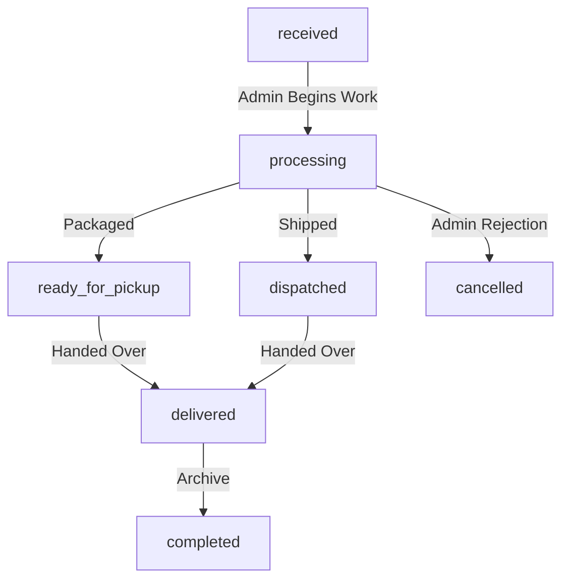

# GoldPlus Pass H1I-P0 — Order Operations Admin & Fulfillment Control Tower Implementation Plan

This document defines the architectural audit, H1D privacy preservation verification, and technical implementation plan for building the GoldPlus Order Operations Admin and Fulfillment Control Tower (`H1I-P1`).

---

## 1. Relational Architecture & Baseline Findings

Our codebase audit revealed the following foundation details:

### 1.1 Existing Database Schema
The persistent layer defined in `apps/api/src/infrastructure/db/schema/commerce.ts` maps these relational entities:
*   **`orders`**: Keeps primary checkout logs including `id`, `orderNumber`, `buyerType`, `customerName`, `customerPhone`, `customerEmail`, `deliveryArea`, `deliveryAddress`, `status` (default: `received`), and `paymentStatus` (default: `unpaid`).
*   **`orderItems`**: References order keys and lists `sku`, `productName`, `quantity`, and `unitPrice`.
*   **`payment_attempts`**: Records PesaPal transitions with fields for `merchantReference`, `orderTrackingId`, `amount`, `currency`, `status`, `redirectUrl`, `ipnReceivedAt`, and `callbackReceivedAt`.

### 1.2 Active Domain Models & Logic
*   **`Order` Domain Entity** (`apps/api/src/domain/commerce/Order.ts`):
    *   **Statuses**: `received` | `pending_payment` | `pending_owner_review` | `processing` | `completed` | `cancelled` | `failed`.
    *   **Payment Statuses**: `unpaid` | `pending` | `paid` | `failed`.
    *   **Business Rules**: Wholesale/Corporate orders are initialized as `pending_owner_review` instead of `received`.

### 1.3 Repository & API Interfaces
*   **Repository Interfaces**: `DrizzleOrderRepository` exposes `findAll()`, `findById()`, and `save()`. `DrizzlePaymentAttemptRepository` manages CRUD operations for PesaPal checkouts.
*   **Public API Endpoints**:
    *   `POST /commerce/orders/lookup`: Secure unauthenticated order progress status lookup.
    *   `GET /commerce/orders/:id`: Authenticated customer-only order lookup.
*   **Admin API Endpoints**:
    *   `GET /governance/admin/orders`: Fetches all orders via `GetOrderListUseCase`. Currently displays a simple, read-only list.

---

## 2. Identified Operational Gaps

Our forensic audit discovered the following functional limitations:
1.  **No Admin Order Detail Route**: Admins cannot view a detailed single order view (`GET /admin/orders/:id`).
2.  **No Fulfillment Status Transitions**: There are no API controllers or write operations allowing an admin to move an order through logistical states (`received` -> `processing` -> `dispatched` -> `delivered`).
3.  **No Payment Attempt Visibility**: PesaPal payment attempts are isolated in database rows. Admins cannot review failed, expired, or verified transaction logs relative to an order.
4.  **No Internal Operational Notes**: Admins cannot attach support or operational logs (e.g., dispatch reference or phone verification comments) to buyer orders.
5.  **No Order Filtering/Search**: The UI orders table displays a raw array. Search by number, or filtering by payment status, fulfillment state, and date range is completely missing.

---

## 3. H1D Privacy & Security Guardrails

The public tracking flow implemented in `H1D` must remain securely locked. Our audit verifies that:
1.  **Authoritative Authentication**: Full customer contact coordinates (unmasked email, phone, and delivery address) can **only** be exposed in the administrative control tower behind verified admin session token checks (`authMiddleware` + `requirePermissions`).
2.  **Public Masking Preserved**: The public `/orders/lookup` endpoint will remain strictly rate-limited (5 failures max per 10 minutes) and continue to mask phone (`078****567`) and email coordinates (`j***e@gmail.com`).
3.  **Draft Bypassing Protected**: Offline `GP-DRAFT` lookups will bypass database checks immediately in storefront logic to prevent denial-of-service or query abuse.
4.  **No Weakening Proposed**: This plan does not expose any unmasked PII publicly. All details in `/admin/*` are strictly guarded by Hono JWT verification.

---

## 4. Proposed H1I-P1 Technical Scope

We propose building a secure, read-focused operations console with strict state-transition boundaries:

### 4.1 Order Operations Workflow Model
Fulfillment and Payment states will remain completely separate:

### 4.2 Strict Payment State Truthfulness
*   **No Manual Payments Confirmation**: The system will have **no** controls allowing admins to manually change a PesaPal order's state to `paid`. All payment settlement updates are strictly driven by cryptographic provider webhooks or GetTransactionStatus calls.
*   **Read-Only PesaPal Relays**: Admins will only review verified PesaPal metadata (Tracking ID, Merchant Reference, Paid Amount/Currency, Callback/IPN logs, and status checked times) without modifying payment states manually.

### 4.3 Proposed UI Views
1.  **`GET /admin/orders` (List View)**:
    *   Interactive filter bar: search by order number, filter by fulfillment status (`orders.status`), filter by payment status (`orders.paymentStatus`).
    *   Displays buyer information, order value, payment state, and date.
2.  **`GET /admin/orders/[id]` (Detail View)**:
    *   Unmasked admin-only customer name, phone, email, and detailed delivery address.
    *   List of product items, quantities, and pricing.
    *   **Payment Log Panel**: Relational history of all PesaPal `payment_attempts` associated with the order.
    *   **Transition Control Console**: Dropdown selector allowing operators to move fulfillment states safely (restricted to allowed transitions, e.g. `received` -> `processing`).

---

## 5. Schema & Database Decision
We will **avoid database migrations** in `H1I-P1` by utilizing the existing schema columns:
*   `orders.status` will be used as the fulfillment state (mapping our workflow: `received`, `processing`, `dispatched`, `delivered`, `completed`, `cancelled`).
*   `orders.paymentStatus` will represent the payment status (`unpaid`, `pending`, `paid`, `failed`, `reversed`).
*   Additional internal operational notes or timelines will be deferred to subsequent releases to avoid complex schema changes, keeping the pre-deployment state clean and secure.

---

## 6. Directory and File Boundaries

### 6.1 Files Expected to Edit
*   **API Routes**: `apps/api/src/interfaces/http/routes/governance.ts` (Mounting admin detail and fulfillment transition endpoints).
*   **Astro Admin UI Pages**:
    *   `apps/web/src/pages/admin/orders/index.astro` (Adding filters and search).
    *   `apps/web/src/pages/admin/orders/[id].astro` (New detailed dashboard with transition controls).

### 6.2 Files Protected (Must Remain Untouched)
*   **Storefront Analytics & Merchandising**: `apps/web/src/components/recommendations/*`, `apps/api/src/domain/recommendations/*`, `apps/api/src/application/recommendations/*` (Frozen).
*   **Visitor Intelligence & Core Tracking**: `apps/api/src/domain/fakeReports/*`, `tests/unit/visitor-intelligence.test.ts` (Frozen).
*   **Payment Settlement Logic**: `apps/api/src/application/use-cases/payments/*` (Frozen).

---

## 7. Testing Plan (Vitest)
1.  **`AdminOrderDetailsAuth.test.ts`**: Verify `/admin/orders/:id` rejects anonymous and customer tokens with 401/403.
2.  **`OrderStateTransitions.test.ts`**: Verify admins can transition fulfillment states, but invalid states or manual "paid" assignments are rejected by backend verification.
3.  **`OrderPrivacyIsolation.test.ts`**: Verify H1D customer PII remains fully masked on public endpoints and exposed only to authenticated admin sessions.

---

## 8. Rollback and Contingency Plan
1.  **Immediate Reversion**: Roll back to the locked release tag `production-deployment-readiness-h1h-p0`.
2.  **State Reset**: Since no database migrations are run, reverting the code will restore the system to its clean pre-deployment baseline without data corruption risk.
