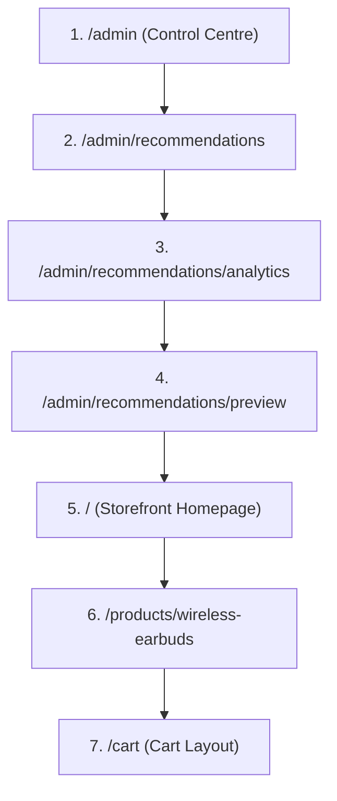

# GoldPlus Pass 13E — Operator Guide and Team Demo Script

This document serves as the operational guide and walk-through talk track for the GoldPlus Recommendation Analytics system. It enables the product and merchandising teams to understand, operate, and trust the commerce intelligence signals without exposing sensitive customer data or introducing artificial financial metrics.

---

## Part 1: Operator Guide

### 1. Overview & Business Purpose
The GoldPlus Recommendation Analytics system provides real-time, privacy-compliant tracking of storefront merchandising performance. By capturing first-party interaction signals (Impressions, Clicks, and Add-to-Cart events), it allows administrators to measure the direct impact of recommendation placements and active merchandising rules on visitor buying paths.

### 2. How to Access the Dashboard
1. Open your browser and navigate to the GoldPlus Admin Console: `http://localhost:4321/admin`.
2. Select **Recommendations** from the sidebar menu, or directly go to `/admin/recommendations/analytics`.
3. If prompted, log in using your administrator credentials:
   - **Email**: `robsebunya@gmail.com`
   - **Password**: `Goldplus2026!`

---

### 3. Understanding Summary Metrics

The dashboard features eight high-level summary cards. Each card measures a specific aspect of the recommendation lifecycle:

| Metric | Business Definition | Notes / Formulas |
| :--- | :--- | :--- |
| **Impressions** | Total times a recommended product was rendered on a page layout. | Simple raw event count. |
| **Clicks** | Total times a user clicked a recommended product. | Measures initial interest. |
| **CTR (Click-Through Rate)** | The ratio of recommendation clicks to total recommendation impressions. | $\text{CTR} = \frac{\text{Clicks}}{\text{Impressions}}$ |
| **Items added to cart** | Count of add-to-cart events directly attributed to a clicked recommendation. | Requires a click within the matching session. |
| **Add-to-cart rate (ATC)** | Percentage of recommendation impressions that resulted in an add-to-cart. | $\text{ATC} = \frac{\text{Add-to-Cart Events}}{\text{Impressions}}$ |
| **Recommendation Share** | The proportion of total platform events influenced by recommendations. | Measures user engagement compared to organic navigation. |
| **Organic / No Rule** | Placed recommendations that were shown *without* an active merchandising rule. | Footnote: "Organic / no rule means the product appeared without a merchandising rule." |
| **Rule Influenced** | Placed recommendations that were modified or forced by an active rule. | Highlights rule effectiveness. |

---

### 4. Performance Breakdowns

#### Placement Performance
Displays impressions, clicks, CTR, and add-to-cart actions segmented by physical storefront slots (e.g. `home_trending` vs `cart_addon` vs `product_related`). This identifies which placements command the highest buyer attention.

#### Rule Performance
Compares the performance of merchandising rules (e.g., specific pinned items or category cross-sells) against organic recommendations. Helpful for testing the strength of custom rules.

#### Product Performance
Details how individual products perform when featured in recommendations. Products with high CTR but low ATC may require detail page or price reviews.

---

### 5. Diagnostics & System Health

#### Event Health (Signal Tracking)
Enforces transparency in the platform data loop:
- **System Health States**:
  - `Healthy` (Green badge): Signals are streaming actively.
  - `Quiet / No Recent Signals` (Yellow badge): The tracking system is active, but no events have been received in the last 24 hours. Helpful for detecting quiet periods or testing delays.
- **Latest Signal**: The timestamp of the absolute latest tracking signal received.
- **Missing Attribution / Missing Product**: Counts of malformed events that are missing matching attribution IDs or product context (automatically triggers a quality warning if above 5% of total events).

#### Identity Health (Visitor Linkage)
Measures identity resolution efficiency:
- **Matched Visitors**: Percentage of anonymous visitor sessions successfully stitched to a customer profile or lead.
- **Lead / Customer Links**: Absolute count of anonymous sessions resolved to MTN/Airtel leads or authenticated shoppers.

---

### 6. Unavailable Metrics (Absolute Honesty)
To maintain strict analytical integrity, the system **never invents fake financial metrics**. If data is not connected, it is clearly declared:
- **Revenue Attribution**: Requires completed order/payment linkage and is deferred to future passes.
- **Completed Order Conversion**: Requires payment gateway hookup.
- **Customer Lifetime Value (CLV)**: Requires multi-order history.
- **ROAS / Profit Contribution**: Requires marketing cost sheets and margin tables.

---

### 7. How to Seed Local Demo Data
To populate the database with a high-fidelity, privacy-safe analytics dataset:
1. Open your terminal in the workspace root.
2. Run the dedicated seed script:
   ```bash
   pnpm tsx scripts/seed-recommendation-analytics-demo.ts
   ```
3. The script will securely insert believable impression, click, and cart-addition chains across various placements without exposing any personal data.

---

## Part 2: Team Demo Script

Use this talk track and route sequence to demonstrate the commerce intelligence loop to stakeholders.

### Route Sequence & Talk Track



#### Step 1: Admin Control Centre
- **Route**: `/admin`
- **Talk Track**: *"We begin in the Admin Control Centre. Under System Status, our core services are healthy. Let's look at recommendations."*

#### Step 2: Recommendations Dashboard
- **Route**: `/admin/recommendations`
- **Talk Track**: *"This lists our active rules. We want to understand their performance, so we move to the Analytics tab."*

#### Step 3: Recommendation Analytics
- **Route**: `/admin/recommendations/analytics`
- **Talk Track**: *"Here is our live recommendation analytics dashboard. You'll notice immediately that we show real signal metrics: impressions, clicks, CTR, and items added to cart. There are no fake metrics here—no simulated revenue, no guessed profits. Where order connection is still in development, we honestly mark those metrics as 'Not available' with plain explanation cards.
In the left panel, Event Health lets us know our signal quality is Healthy, and Identity Health shows that we are resolving anonymous sessions to profiles safely. Our tables break down exactly which placements, rules, and products are driving the highest CTR and cart additions."*

#### Step 4: Rule Placement Preview
- **Route**: `/admin/recommendations/preview`
- **Talk Track**: *"To verify how recommendations appear to users, we can preview active placements live in the admin area before going storefront-live."*

#### Step 5: Storefront Homepage
- **Route**: `/`
- **Talk Track**: *"On the customer storefront, trending products are loaded via recommendations. As a visitor views these, an anonymous impression event is securely captured."*

#### Step 6: Product Details
- **Route**: `/products/wireless-earbuds`
- **Talk Track**: *"When a user clicks a recommendation, it attributes the visit. A clicked signal flows instantly, maintaining high resolution."*

#### Step 7: Cart Page
- **Route**: `/cart`
- **Talk Track**: *"Adding a recommended product to the cart completes the click-to-cart funnel. This gives us high-fidelity placement conversion numbers."*

---

## Part 3: Deferred Merchandising Features
The following items are deferred to future releases:
1. **Completed order attribution**: Connecting recommendations to final payment success webhooks.
2. **True profit margin calculation**: Syncing product buy costs with order totals.
3. **Multi-device journey stitching**: Linking sessions across multiple browsers when a user authenticates late.
