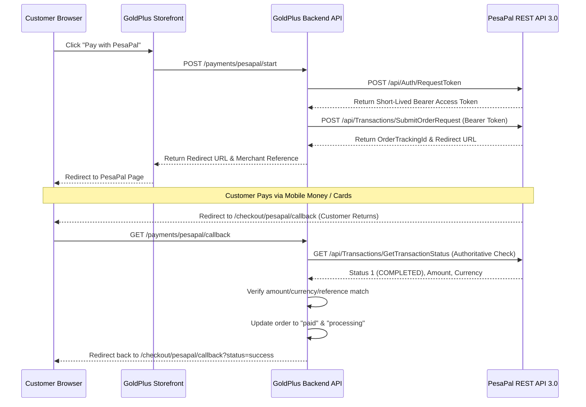

# GoldPlus Pass H1G-P1 — PesaPal Backend Payment Foundation Runbook

This document details the architectural design, implementation details, and verification runbook for the PesaPal API 3.0 REST payment integration implemented in Phase H1G-P1.

---

## 1. PesaPal API 3.0 REST Integration

GoldPlus uses **PesaPal API 3.0** JSON endpoints for payment processing and verification. 

### Gateway Endpoints
*   **Sandbox Base URL**: `https://cybqa.pesapal.com/pesapalv3`
*   **Production Base URL**: `https://pay.pesapal.com/v3`

### API Lifecycle Sequence


---

## 2. Configuration & Local Dev Setup

Payment credentials and endpoints are resolved dynamically at runtime using environment variables. All variables are optional during start/bootstrap to prevent build/test failures when secrets are omitted.

### Environment Variables (`apps/api/.env`)
```bash
# Gateway Mode ('sandbox' or 'production')
PESAPAL_ENV=sandbox

# PesaPal API 3.0 Customer Portal Credentials (never logged or serialized)
PESAPAL_CONSUMER_KEY=your_pesapal_consumer_key
PESAPAL_CONSUMER_SECRET=your_pesapal_consumer_secret

# Secured IPN ID registered in PesaPal Merchant Portal
PESAPAL_IPN_ID=your_registered_ipn_id

# Merchant & Currency Presets
PESAPAL_CURRENCY=UGX
PESAPAL_BRANCH="GoldPlus Kampala Main Branch"

# Redirection Targets
PESAPAL_CALLBACK_URL=http://localhost:3000/checkout/pesapal/callback
PESAPAL_CANCELLATION_URL=http://localhost:3000/checkout/pesapal/cancelled
```

---

## 3. Strict Verification & No-Fake-Paid Integrity Rules

To protect against request tampering, GoldPlus implements **strict authoritative transaction status verification**:
1.  **No Direct State Mutation**: Neither callback redirection query parameters nor IPN webhook payloads can set an order to "paid" directly.
2.  **Auth Call Enforcement**: The backend must request transaction status directly from PesaPal's `GetTransactionStatus` API using secure Bearer authentication.
3.  **Cross-Validation Integrity Routine**:
    *   **Merchant Reference**: Must match the original generated reference.
    *   **Total Amount**: Must match the exact amount registered in our `payment_attempts` table.
    *   **Currency**: Must strictly match the Ugandan Shilling (`UGX`) original record.
4.  **Failure State**: Any mismatch in amount, currency, or merchant reference immediately aborts processing, marks the attempt as `verification_failed`, and leaves the order unpaid.

---

## 4. Database Schema: Payment Attempts Ledger

To track multiple attempts safely without polluting the core `orders` table, a persistent Drizzle model is appended:

```typescript
export const paymentAttempts = pgTable('payment_attempts', {
  id: uuid('id').defaultRandom().primaryKey(),
  orderId: uuid('order_id').references(() => orders.id).notNull(),
  merchantReference: varchar('merchant_reference', { length: 255 }).unique().notNull(),
  orderTrackingId: varchar('order_tracking_id', { length: 255 }),
  amount: integer('amount').notNull(),
  currency: varchar('currency', { length: 10 }).default('UGX').notNull(),
  status: varchar('status', { length: 30 }).default('not_started').notNull(),
  redirectUrl: varchar('redirect_url', { length: 512 }),
  provider: varchar('provider', { length: 50 }).default('pesapal').notNull(),
  ipnReceivedAt: timestamp('ipn_received_at', { withTimezone: true }),
  callbackReceivedAt: timestamp('callback_received_at', { withTimezone: true }),
  createdAt: timestamp('created_at', { withTimezone: true }).defaultNow().notNull(),
  updatedAt: timestamp('updated_at', { withTimezone: true }).defaultNow().notNull(),
});
```

---

## 5. Rollback Sequence

If critical production regressions occur:
1.  **Code Reset**: Roll back to the stable H1F catalogue admin baseline:
    ```bash
    git reset --hard product-catalogue-admin-h1f
    ```
2.  **Database Migration Reversion**: Apply Drizzle database migrations to drop the `payment_attempts` table.
3.  **Environment Deactivation**: Remove `PESAPAL_CONSUMER_KEY` and `PESAPAL_CONSUMER_SECRET` from server configurations. The storefront forms will automatically fall back to local drafts/offline demo modes safely.
