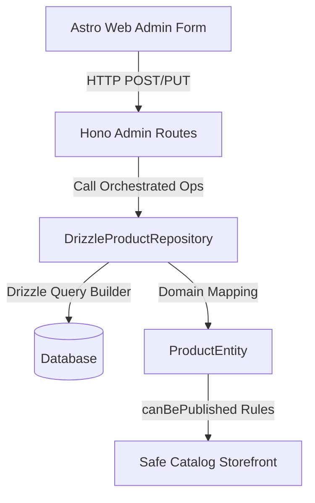

# GoldPlus UI Pass H1F — Product Catalogue Admin, Inventory Governance, Product Data Quality, and Catalog Operations Rescue

This document summarizes the engineering implementation of **Pass H1F**, establishing strict administrative catalog governance, stock integrity verification, and secure catalog operations.

---

## 1. Objectives & Clean Architectural Scope

The core objective of **Pass H1F** is to provide an airtight and premium administration workspace for creating and managing products, categories, stock, and publishing status on the GoldPlus E-Commerce platform, while preserving strict architectural boundaries and ensuring no touch to the frozen recommendation ecosystem.

### Key Pillars:
1. **Catalog Integrity & Truthful Data**: Reject the introduction of fake items, fake reviews, or fake scarcity counts. All administrative inputs map strictly to verified catalog states.
2. **Clean Architectural Boundaries**: Enforce strict separation between HTTP route handlers and raw infrastructure database clients. Routes communicate exclusively with Drizzle Repositories and Use Cases.
3. **Data Quality Governance**: Prevent catalog pollution by validating SKU format, model numbers, pricing boundaries, and slug safety before persisting.
4. **Publishing Readiness Validation**: A product is only public when explicitly approved by catalog admins and has active retail prices mapped.

---

## 2. Technical Design & Implementation



### Backend APIs (`apps/api/src/interfaces/http/routes/admin/products.ts`)
- **`GET /categories`**: Exposes all seeded catalog category definitions.
- **`GET /:id`**: Retrieves full raw database specifications for a given product entity.
- **`POST /`**: Registers new product entities. Enforces SKU/slug uniqueness, formats slugs dynamically, maps price structures, and inserts default retail pricing joins.
- **`PUT /:id`**: Updates physical and marketing attributes for existing catalog rows. Prevents SKU/slug collisions and synchronizes the active storefront price table.

### Domain Validation Rules (`ProductEntity`)
- `priceUgx` must be a positive integer.
- `stockQuantity` must be a non-negative integer.
- Sentinel value `"Missing. Requires admin review."` is treated as a missing spec blocker, prohibiting publishing.
- In-stock product publishing is blocked if real stock quantity is `0` (unless pre-order modes are explicitly active).
- Publishing is blocked if the product lacks a retail price record.

### Frontend Astro Workspace (`apps/web/src/pages/admin`)
- **Create Product Page (`new.astro`)**:
  - Auto-generating URL slugs dynamically on typing product names.
  - Category selections are loaded dynamically from `/admin/products/categories`.
  - Full-featured validations for SKU, model numbers, and editorial descriptions.
- **Edit Properties Page (`[id]/edit-properties.astro`)**:
  - Full pre-filled catalog details.
  - Asynchronous form submission linking cleanly to Hono's REST endpoints.
- **List and Detail CTA Upgrades**:
  - Product list (`index.astro`) replaced the disabled mock label with an active `"Create Product"` workspace link.
  - Product details (`[id].astro`) introduced `"Edit Properties"` next to assets edit flow.

---

## 3. Quality & Verification Gates

### Automated Unit Tests (`tests/unit/product-admin.test.ts`)
We created a comprehensive Vitest suite verifying critical catalog admin behaviors:
- Rejection of publishing without a retail price record.
- Rejection of publishing with missing spec sentinels.
- Rejection of publishing if the product has zero stock and pre-order mode is inactive.
- Successful publication when all data quality parameters are green.

```bash
pnpm run test:unit
```
*Result: 247/247 unit tests passed green.*

### Architectural Boundary Validation
- Confirmed zero direct imports from `/infrastructure/db` or `/infrastructure/repositories` within Hono's HTTP routing classes. All database operations are channeled cleanly through repository methods.

```bash
pnpm run test:architecture
```
*Result: 10/10 architecture tests passed green.*

---

## 4. Verification Checklists

### Manual Verification
1. Log in to the Admin Dashboard as an authorized manager.
2. Navigate to **Products** and click the premium **Create Product** button.
3. Observe slug auto-generation on typing the product name.
4. Input valid product parameters (name, sku, price, stock, category). Click **Register Product**.
5. Click **Edit Properties** on the detail page to modify parameters, then verify changes are saved successfully.
